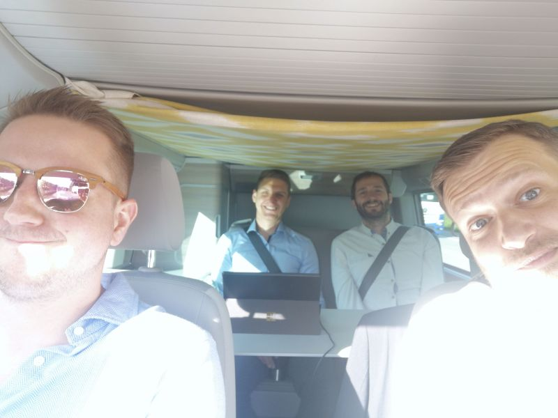

---

Robotics gives machines hands. AI gives machines judgment. Monitoring gives machines senses. Without the senses, the hands are blind and the judgment is deaf.

---

## The Apple on the Tree

Ten years ago, as a student, I asked myself a simple question: **why does this apple cost money?**

The apple growing on the branch costs nothing. The apple in the store costs something. The difference is human labor — hands that picked it, trucks that moved it, systems that tracked it. Every euro in the price tag is a unit of human time that had to be spent.

If that is true, then the path to making humanity genuinely richer is not to work more. It is to need fewer human hours per unit of civilization.

This is why we build what we build.

---

## The Uncomfortable Truth

Most people fear automation because they think in zero-sum terms: machines take jobs, humans starve. This is wrong — historically wrong and philosophically wrong.

The printing press didn't kill scribes to enrich publishers. It made knowledge accessible to everyone. The steam engine didn't enslave workers — it eventually freed them from fourteen-hour days in the field. Every wave of automation that looks like destruction from the inside looks like liberation from the outside.

We are at the beginning of the greatest liberation in human history. And most people are still arguing about whether to allow it.

A few things we hold to be true — and say out loud:

- **Most operators think they are watching their processes. They are watching indicators. Indicators are not data.**
- **Everyone is racing to add AI to their factory. Nobody asks where the data comes from. You cannot solve in the abstract domain if your transform is broken.**
- **The consultant who tells you to rip and replace is selling you their project, not your solution. The world runs on installed base. It always will.**
- **Critical infrastructure that isn't monitored isn't critical — it's just unexamined risk.**

---

## What We Actually Believe

We build monitoring systems. That sounds modest. It isn't.

A machine that cannot monitor itself cannot maintain itself. A machine that cannot maintain itself requires human attention. And humans watching machines is precisely the kind of work that should not require humans.

We believe: **machines should do everything that machines can do** — so that humans are free to do everything that only humans can do.

We are convinced that the soul is not a process. Not a pattern. Not an emergent property of sufficient compute. The creative, the musical, the philosophical, the spiritual — these are not outputs of a sufficiently trained model. They are the signature of something that cannot be automated, and we will never pretend otherwise.

We work only on projects that move humanity toward a state where more people can live creatively, without worrying about food on the table. If a project does not serve that direction, we are not interested.

---

## The Transform

There is a concept in mathematics that I use every day outside of mathematics: **the Laplace transform**.

When a differential equation cannot be solved in its original domain, you transform the problem into an abstract space where the solution becomes tractable — then you transform back. Physics describes the world in measurable quantities. Mathematics provides abstract solutions. Engineers translate those solutions back into reality.

This is how we approach every problem. We do not fight complexity where it is hardest. We transform. We solve. We return.

When I chose my field, I looked at robotics first. Exciting, well-funded, visible — and crowded with a thousand companies building manipulators. Then LLMs and autonomous reasoning — equally crowded. But when I looked at actual industry, I saw something unexpected: **the transformation step was broken.**

Data was being extracted from PLCs through protocols never designed for scale. Or entered by hand into SAP forms. Neither is a real transform — one is a bottleneck, the other is a human acting as a transducer.

The gap was not in robotics. The gap was not in AI. The gap was in the instrument itself.

A monitoring system is that instrument — the transform applied to the physical world.

The physicist stands before a phenomenon: vibration, temperature, current, pressure. They do not solve it in the noisy, continuous, messy original domain. They describe it formally. That formal description is what makes computation possible.

**The sensor is the act of transformation.** The data stream is the abstract domain. The anomaly detection, the predictive model, the threshold alert — these are the solutions, computed where solutions are easy. And the actuation, the maintenance call, the adjusted process parameter — that is the inverse transform, back into physical reality.

But the sensor alone is not enough. A raw signal without a time series database, without cleaning, without context is not usable by any analytical system. The physicist does not just measure — they record, annotate, calibrate, and structure. A monitoring system is the automated physicist: it captures the signal, stores it with temporal precision, strips the noise, adds the context, and delivers something that analysis, prediction, and prevention can actually act on. We design and build every system with that full chain in mind — not just data collection, but data that is ready to be reasoned about.

You cannot solve problems in the abstract domain if your transform is lossy, delayed, or manual. This is not a metaphor for us. It is the operating principle.

---

## The Instrument

We believe the sensor must be native to the network.

Not polled through serial middleware. Not manually entered. Not bridged through industrial protocols that predate the internet. USB and TCP/IP — the same connectivity that made the web universal.

Our preferred device: a PoE unit that plugs into a switch, receives its address via DHCP, announces itself on the local network via [slook](https://github.com/dominicpoeschko/slook/), and is ready to be found. No configuration wizard. No integration project. Plug in — and it works.

Where network infrastructure does not reach, we go wireless: WiFi with battery, LoRa or cellular with energy harvesting. But we are honest about the physics: **the further a device is from its processing environment, the worse the signal.** Bandwidth falls. Accuracy falls. Latency rises. This is not a complaint about wireless technology — it is a law of physics, and we respect it. We optimize for proximity. We treat distance as cost.

---

## The Installed Base Is the World

We focus on retrofit. Not greenfield.

This is a philosophical choice as much as a commercial one.

The factories that exist, the machines that run, the processes that produce — these are not going to be torn down and rebuilt as ideal systems. They are what they are. They represent decades of engineering, capital, and institutional knowledge. Greenfield projects are the exception. The world as it stands is the rule.

We believe it is better to make what exists measurable than to build perfect systems that never touch the machines that actually run civilization. Every retrofit installation is an act of transformation: a previously opaque process becomes legible, computable, improvable.

That is where we work. And we have been proving it for twelve years — in nuclear cooling circuits, mine shafts, Montana rivers, rail switching systems, defense platforms, and semiconductor fabs.

---

## Who We Are

Auto-Intern was founded by Odin Holmes — a hardware and firmware designer from the woods of Oregon — and Prof. Dr. Benjamin Menküc, whose advisory fingerprints remain on the architecture. When I, Stephan Bökelmann, joined in 2014, Odin and I changed the business model: from USB interfaces for automotive OBD to *if we can measure it, you can improve it*.

Today we are around twenty engineers from physics, electrical engineering, computer science, and cybersecurity. The people who shape the work: Odin on hardware and firmware, Tabea Bökelmann on frontends and APIs, René Glitza on federated and fully homomorphic learning, Philipp Lehmann on security and deployment.

Alongside Auto-Intern GmbH — the measurement device company — we run nerd_force1, which builds the server-side: our own data center, Kubernetes and Ceph clusters, security-first from the ground up. Sensor to server, owned end to end.

Our customers are in large manufacturing, critical infrastructure, and defense. Wherever an unmonitored process quickly becomes very expensive.

---

## The Future We Are Building Toward

There will be automated production on other planets. Not because we are science fiction enthusiasts, but because it is the logical conclusion of everything we are building toward — supply chains that do not depend on human presence in a specific location, systems that maintain themselves, infrastructure that extends the reach of human civilization without extending its cost.

We are techno-optimists. The process of transformation has already begun. The question is not whether it will happen — it is whether we will shape it with moral clarity and engineering rigor, or let it happen to us.

If we do this right, the answer to the apple problem is not poverty. It is abundance. It is a world where more people have more time for the things that only humans can do: to think, to create, to question, to connect, to live as though they were made for something greater than maintenance.

That is the highest form of human striving we know. And it is the only reason we are here.

**We are not naive about how long this takes. But we are clear about the direction.**
