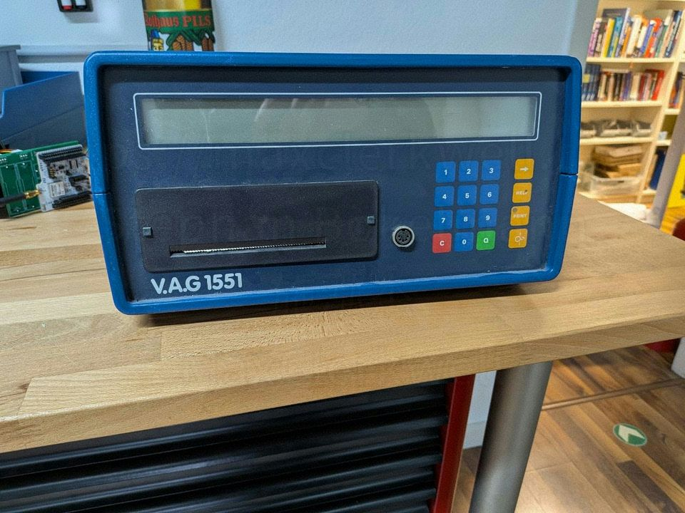
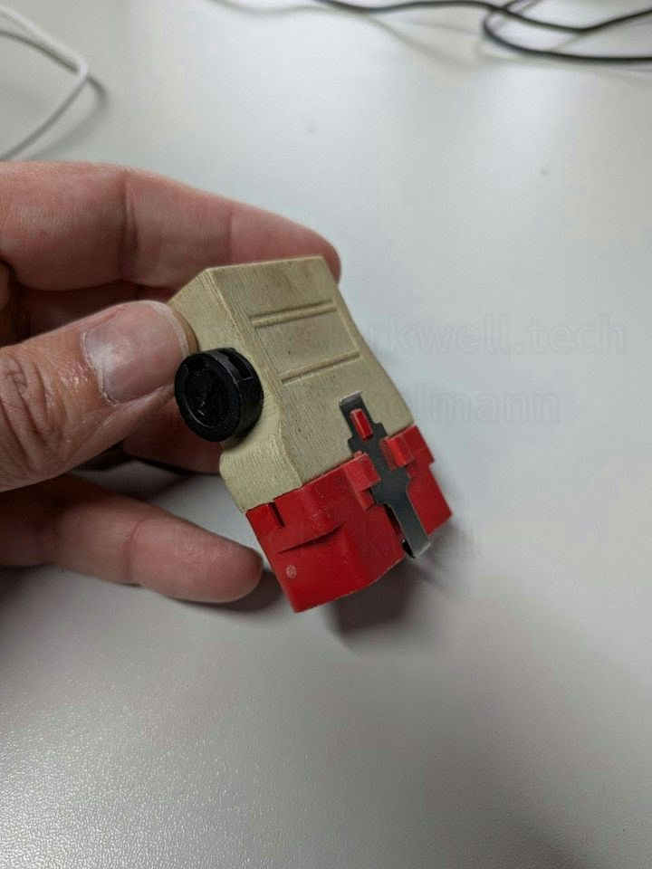
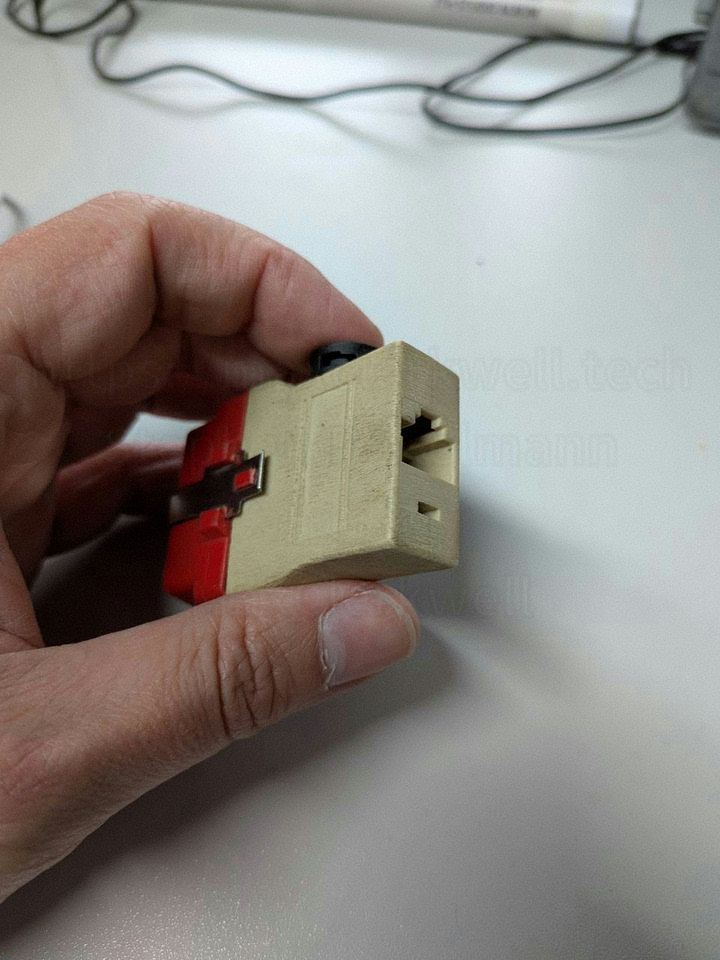
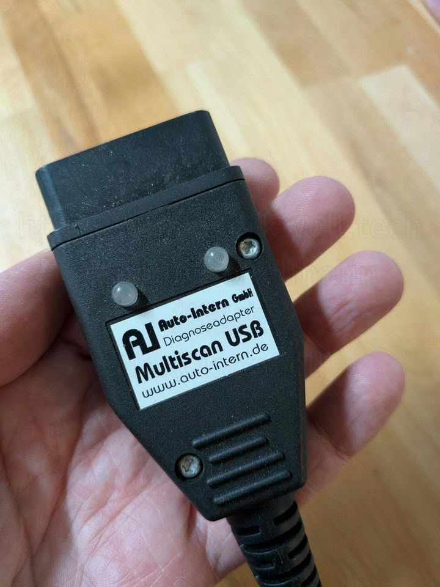
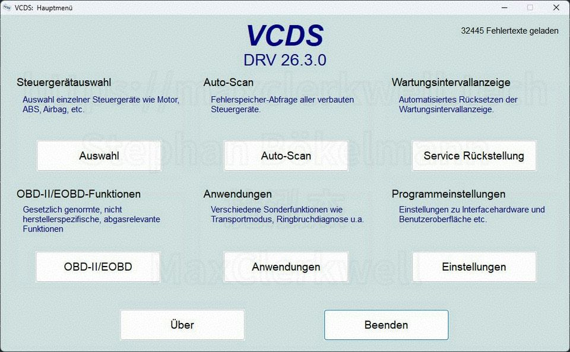
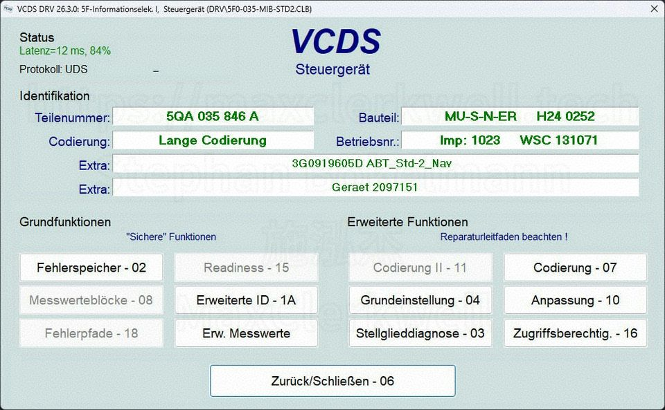
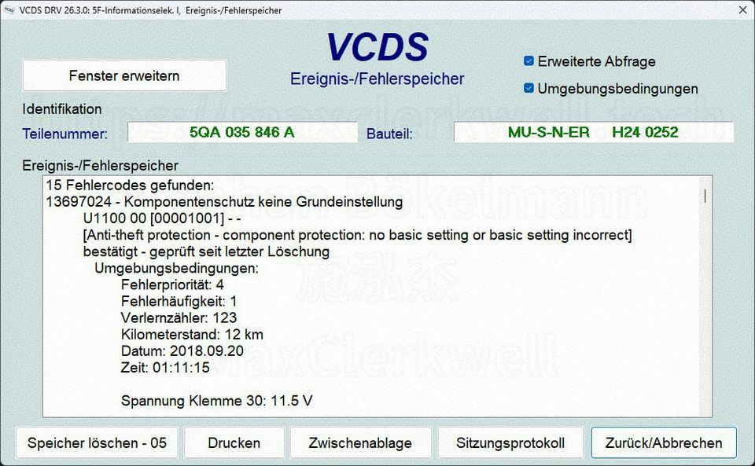
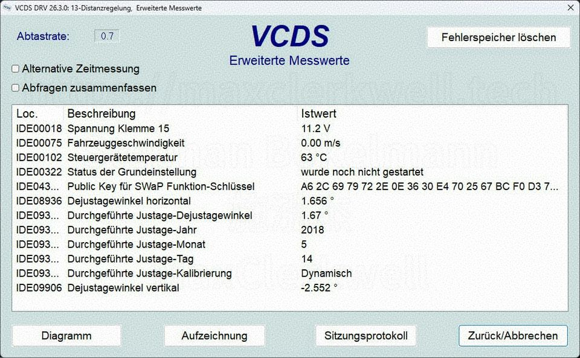
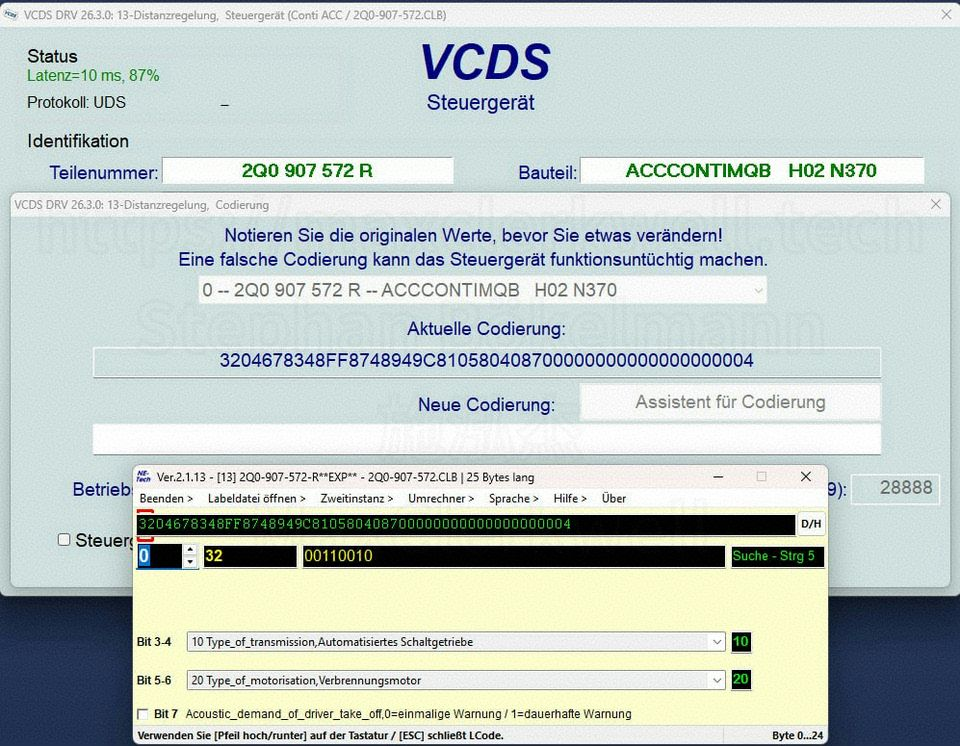
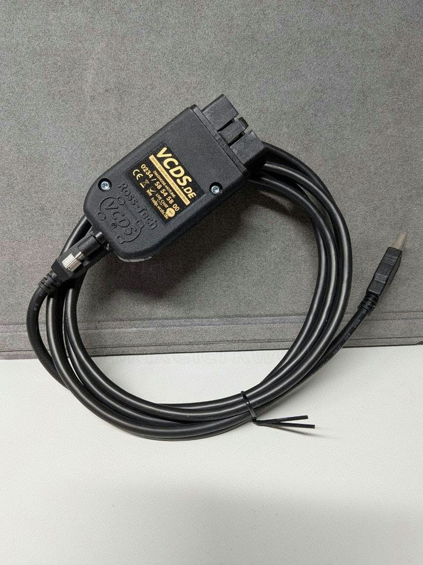

I joined Auto-Intern in 2014, when the company acquired my workshop, Kfz-Technik Bökelmann. By then, Auto-Intern was already an institution in the German-speaking automotive world — the go-to address for VCDS diagnostic interfaces. But the story of how it got there is one I have spent the last decade slowly piecing together from the people who lived it. This year, Auto-Intern turns 25. It feels like the right moment to write it down.

## A GTI, a Radio, and a Wild Idea

In 2001, Benjamin Menküc — everyone calls him Benne — and Odin Holmes were still in school. Odin was an American citizen, in Germany on a student exchange program. The two met as classmates. Benne had a Golf GTI. He also had the very specific frustration of anyone who drives on the Autobahn: at high speed, road noise drowns out the music. His idea was to make the radio adjust its volume automatically based on vehicle speed. Not a revolutionary concept today, but in 2001, it was not something you could simply buy.

To make it work, he needed access to the speed signal from the car's own electronics. That meant OBD — the On-Board Diagnostics interface that had been standardized across the industry in the late 1990s. The problem was that talking to a VAG vehicle over OBD required hardware and software that was either locked inside dealership tooling or simply did not exist in usable form for hobbyists.

So Benne and Odin went to the internet. They found a forum thread describing how to build an OBD-to-RS-232 adapter from scratch. They built one. It worked. And somewhere in the process of solving that one problem, they fell much further down the rabbit hole.

## A Name on a Screen: Uwe Ross

Through those same forums, Benne and Odin made contact with a man in the United States named Uwe Ross. Ross had been pursuing a parallel obsession: reverse-engineering the VAG1552, the proprietary diagnostic tool that Volkswagen dealers used at the time, and rebuilding its functionality as a Windows application connected via a homemade RS-232 adapter.

*The V.A.G 1551, VW's original dealer diagnostic computer. Uwe Ross set out to replicate its successor in software. The result would eventually become VCDS.*

That application became the first version of what is now VCDS — VAG-COM Diagnostic System — and the foundation of his company, Ross-Tech.

The connection between two teenagers in Germany and an American engineer tinkering in his garage is one of those things that could only have happened on the early internet. Uwe Ross had grown up in Freiburg before his family moved to the United States — so there was a thread of familiarity running through what might otherwise have been a cold forum contact. Different continents, different contexts, same obsession. And somewhere in the background, a shared language.

## The Bedroom Business Plan

Benne and Odin saw the shape of an opportunity. Ross-Tech had the software. The German market needed hardware. If they could build licensed OBD-RS-232 adapters and sell them alongside VCDS licenses, there was a real business there.

They needed a name. The story goes that a copy of the German computer magazine *PC Intern* happened to be sitting on the table. Someone said: "Auto-Intern." That was enough. The company was registered in 2001, shortly after the first sales.

They acquired a V.A.G 1551 — the dealer tool itself — as a reference. And they started building.

## The AutoSpion: Building a DIY OBD Diagnostic Tool

The first product was called the AutoSpion. It did exactly what it said: it let you spy on your car's electronics through the OBD port, over RS-232, on a Windows laptop.

The enclosure was a printer port plug — a DB-25 shell — sealed by pressing the two halves together with a clothes iron. The circuit lived inside.

*The AutoSpion, front. The housing is a repurposed printer port plug, heat-sealed with a clothes iron.*

*The AutoSpion, rear. Remarkably compact for something assembled in a teenager's bedroom.*

There is a story that captures those early days better than any description I could write. The AutoSpion was selling well enough that Benne and Odin needed to buy connector housings in real volume — a thousand units. The sales representative from the connector manufacturer came to discuss the order in person. He drove to Benne's house. He sat down with two teenagers in a bedroom surrounded by soldering equipment. He wrote the order.

I do not know what he made of it. But the order went through.

Operations eventually outgrew the bedroom. The company moved to Odin's apartment, then in 2008 to a proper office in Bochum — where it has been ever since.

## The Golf 5 Crisis

In 2004, Volkswagen launched the Golf 5. It introduced CAN bus — the Controller Area Network protocol — as the primary communication backbone. This was a discontinuity. The old K-line protocol that had carried OBD communication in previous generations could not talk to the new architecture. An RS-232 adapter that had worked on every Golf up to that point was now useless on the new one.

This killed a significant portion of the market. Competitors who had built products around the old interface found themselves with no clear path forward. Developing a CAN-capable interface required a real microcontroller, firmware, and a completely different hardware architecture. More than a hundred market participants did not make the transition.

Benne and Odin did not sleep much that year. Within a few months, they had the Auto-Intern Multiscan USB on the market.

*The Auto-Intern Multiscan USB — one of the first aftermarket OBD interfaces with a proper microcontroller for CAN bus communication. Built in Bochum, 2004.*

It was one of the first independent diagnostic interfaces in the German market built around a real microcontroller, capable of handling CAN bus natively. Auto-Intern did not just survive the Golf 5. It emerged from the transition as the dominant player in DACH for VCDS-compatible hardware.

## What VCDS Actually Is

For readers outside the automotive world: VCDS is software that gives you access to the full depth of a Volkswagen Group vehicle's electronics — not just the standardized OBD-II fault codes that any generic scanner can read, but the manufacturer-specific control units: the gearbox, the driver assistance systems, the comfort electronics, the coding registers that determine how subsystems behave.

The screenshots below are from a current installation of VCDS DRV 26.3.0.

*The VCDS main menu. The entry points cover everything from individual ECU selection to full Auto-Scan and service reset functions.*

*VCDS connected to the infotainment ECU (5F). Part number, component build, coding status, and all available functions displayed on a single screen.*

*Fault memory for the same ECU — 15 stored codes, with freeze-frame data including mileage, voltage, and timestamp.*

*Extended live values from the ACC distance control module: speed, temperature, calibration status, sensor angles.*

*Long coding in action. The bit-level editor lets you change specific feature flags — transmission type, engine category, acoustic warnings — without needing factory documentation.*

This depth of access is why VCDS matters to independent workshops. Dealership tooling has it. For a long time, nothing else did. Ross-Tech changed that, and Auto-Intern brought it to the German-speaking market.

## The HEX-V2 and a Pivot to Partnership

In 2016, the automotive industry moved to 29-bit CAN identifiers as standard. Another hardware transition. Benne and Odin made a deliberate choice this time: instead of building a new interface from scratch, they formed a partnership.

HEX — a South African company that had previously been a competitor in the diagnostic interface market — had developed hardware that Ross-Tech was prepared to officially endorse. Auto-Intern became the DACH distribution and finishing partner for the HEX-V2.

*The HEX-V2, the current VCDS-compatible interface. Developed by HEX, endorsed by Ross-Tech, finished and distributed by Auto-Intern from Bochum.*

Final assembly still happens in Bochum. That has not changed.

## Twenty-Five Years Later

Auto-Intern's core engineering competencies have shifted substantially over the years — today the company works heavily in decentralized monitoring and industrial diagnostics (its current platform is the [skAInet Edge-Compute](https://edge-compute.skainet.io/), a sealed M12-PoE Linux box for the factory floor), which is a different world from RS-232 adapters assembled on a bedroom workbench. But VCDS remains a real part of the business and, more than that, a real part of the identity.

What started as a hack to make a car radio louder turned into a company that shaped the independent workshop market in Germany, Austria, and Switzerland for a quarter century. It gave mechanics the same visibility into vehicles that manufacturers had reserved for themselves. It made the diagnostic gap between a franchised dealership and a good independent workshop much, much smaller.

That is not a bad outcome for something that started with a newspaper on a table and a name someone said out loud.

---

*Auto-Intern GmbH is headquartered in Bochum, Germany. VCDS is developed by Ross-Tech, LLC. The HEX-V2 interface is manufactured by HEX and distributed for the DACH market by Auto-Intern.*
