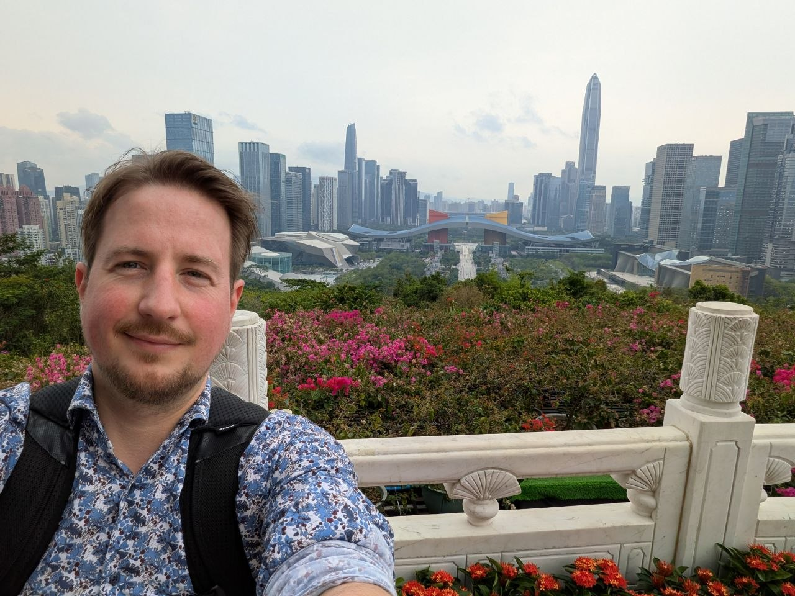
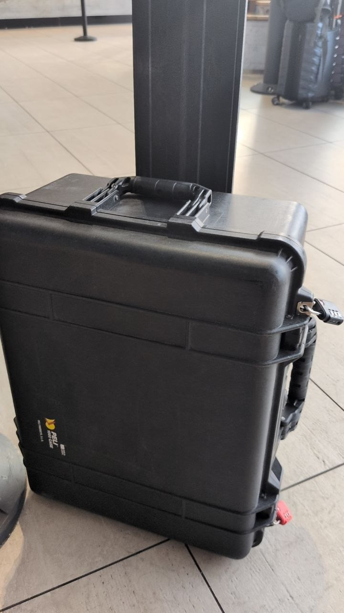
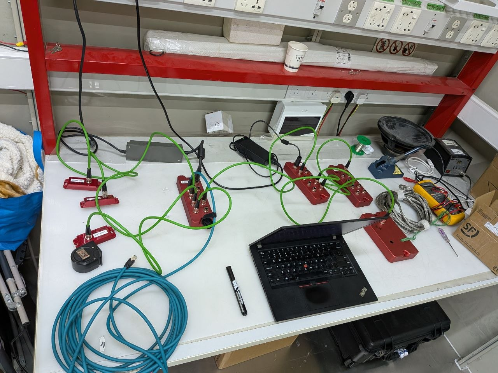
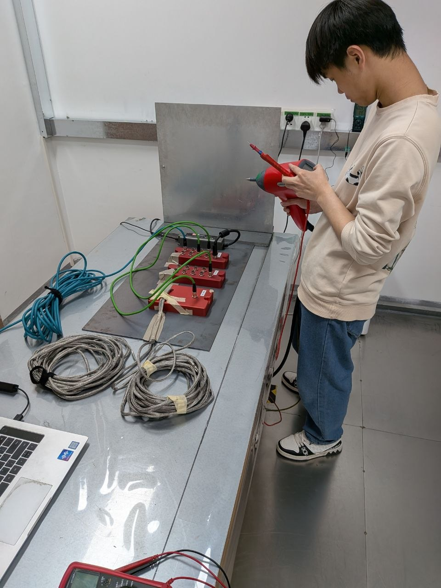
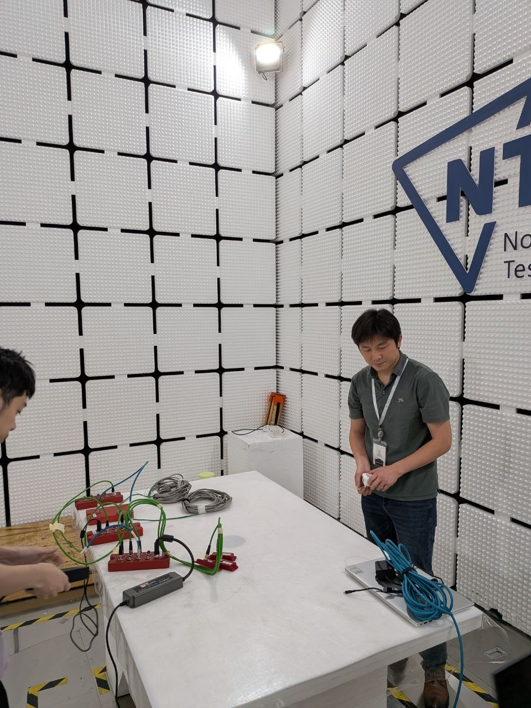
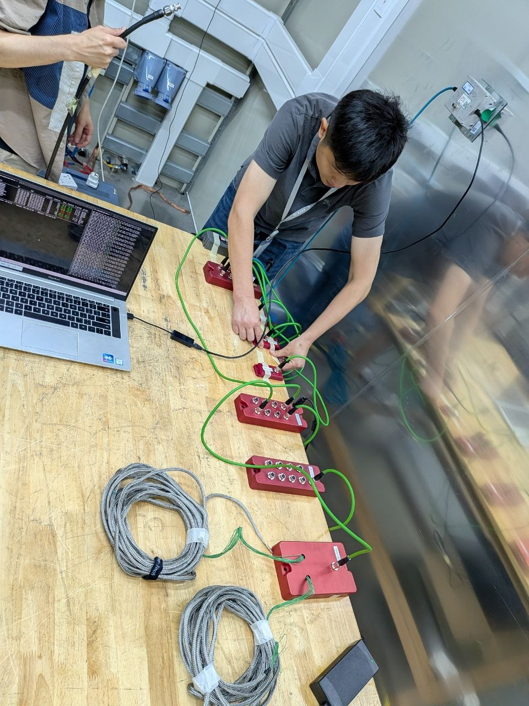

In March I flew to Dongguan, China for four days of EMC testing. It was the last major milestone before our reflow oven monitoring system goes into production. After two and a half years of development, the question was simple: does this thing radiate, and can it take a hit?

It passed. But the story is more interesting than that.

## The Project

The system was commissioned by **GlobalPoint GmbH**, now part of **Kurtz Ersa GmbH & Co. KG**, one of the leading manufacturers of reflow soldering equipment. The brief: build a monitoring system that attaches to Ersa's reflow ovens and gives operators real-time insight into what is actually happening inside the machine — not what the oven *thinks* is happening, but what the physics says.

The development was handled by [**skainet.io**](https://skainet.io), the engineering office of Auto-Intern GmbH. I served as system architect. [**Odin Holmes**](https://x.com/odinthenerd) owned firmware and PCB layout, and [**Tabea Bökelmann**](https://x.com/tabeatheunicorn) designed and built the frontend. Two and a half years. A lot of iteration.

## What the System Does

The core of the system is a central compute module — a compact Linux box with a quad-core processor and more RAM than you would expect for its size. It has two separate Ethernet interfaces: one dedicated WAN uplink, and one connected to an integrated switch chip that exposes seven downstream ports, all of them Power over Ethernet.

Every downstream device is powered and communicated with over those PoE ports. At minimum, the system ships with:

- **A temperature measurement module** — our own design, with custom-made temperature measurement snakes that take in-situ readings at up to 36 points directly inside the solder oven, streaming live to the compute module.
- **A digital I/O module** — reads up to 7 IO-Link sensors and drives a stacklight for at-a-glance status indication.

In the drawer we have further modules in various stages of readiness: vibration, IR camera, temperature/humidity, residual O₂, and ultrasonic structure-borne sound. They weren't part of this certification run, but the architecture is ready for them.

The compute module auto-detects whatever is connected, loads the calibration files, and exposes the data via REST, WebSocket, and MQTT. On the Ersa machine PC, an Electron frontend consumes those APIs to display profile predictions and process quality indices — CPK and several others.

Travelling with professional electronics across borders comes with its own paperwork. I covered the Peli case setup and the ATA Carnet process in a [separate post](/posts/ata-carnet-china-travel/).

## The Test Setup

The lab was **NTC — Nore Detection Technology Co., Ltd** in Dongguan. We tested against three regulatory frameworks: **CE** (Europe), **FCC** (USA), and **CCC** (China). The full test sequence ran over four days:

- Burst (EFT)
- Surge
- 5-second power interruption
- Radiated emissions
- Radiated immunity
- Conducted emissions
- Conducted immunity
- Magnetic field
- ESD

We were not going in blind. We had done preliminary testing in Germany, and we have accumulated a fair amount of PoE-specific EMC experience over the years. All our housings are aluminium. The cables are M12 Cat5e SF/UTP — shielded foil, unshielded twisted pair — which behaves predictably in a test chamber if the mechanical coupling is done correctly.

Everything came back green.

## The One Finding

During the test we noticed that the M12 connectors on the downstream devices did not have adequate coupling to their aluminium housings. The anodized surface was acting as an insulator between the connector shell and the enclosure — not ideal when you are trying to maintain a continuous shielded path.

The fix is straightforward: **serrated lock washers** (Fächerscheiben) under the M12 connector nut. The teeth cut through the anodizing and create a reliable metal-to-metal bond. We did not need to retest, but this goes into the production build as a specification change.

It is exactly the kind of thing you catch when you are in a proper chamber with someone experienced watching the traces.

## The Lab, and Jees

I was expecting a language barrier and I found one — very few people in and around the lab spoke English. But my project manager, **熊伟**, who goes by Jees, spoke excellent English and was present throughout all four days. Attentive, knowledgeable, flexible in how we sequenced the tests. He also handed me several EMC tips that I had not encountered before, which alone made the trip worthwhile.

What surprised me most was the scale of the facility. NTC had far more test chambers than I anticipated — you could run multiple concurrent certifications across different standards without ever waiting for a chamber. The whole operation felt more fluid than equivalent labs I have used in Germany.

I will be back.

## Beyond the Lab

Dongguan is not just a testing stop. While I was there I also sat down with a cable manufacturer, visited [**Faytech**](https://www.faytech.com) and [**NextPCB**](https://www.nextpcb.com), and met with a handful of engineers who had been passed along to me through various contacts. Each of those conversations produced at least one useful lead or piece of information.

My hotel was next to a sports park. Every morning I ran laps with a group of elderly locals who were entirely unbothered by the foreign engineer in their midst and very friendly once I stopped looking lost. I spent several evenings with Chinese acquaintances — KTV, good restaurants, the kind of conversations that only happen when you are somewhere unfamiliar and have to pay attention.

Getting around on Didi was seamless. Dongguan is a serious manufacturing city and it moves accordingly.

## What Comes Next

The certification results go back to Kurtz Ersa. Production planning can start. After two and a half years of development it is a strange feeling — not relief exactly, more like the moment when a long measurement finally stabilises and you can read off the value.

The extended sensor suite (vibration, IR, rest-O₂, ultrasonic) will follow in a subsequent version. The architecture is already there. It just needs time.

---

*The team: [Odin Holmes](https://x.com/odinthenerd) (firmware, PCB layout), [Tabea Bökelmann](https://x.com/tabeatheunicorn) (frontend). Developed at [skainet.io](https://skainet.io) for Kurtz Ersa GmbH & Co. KG.*
