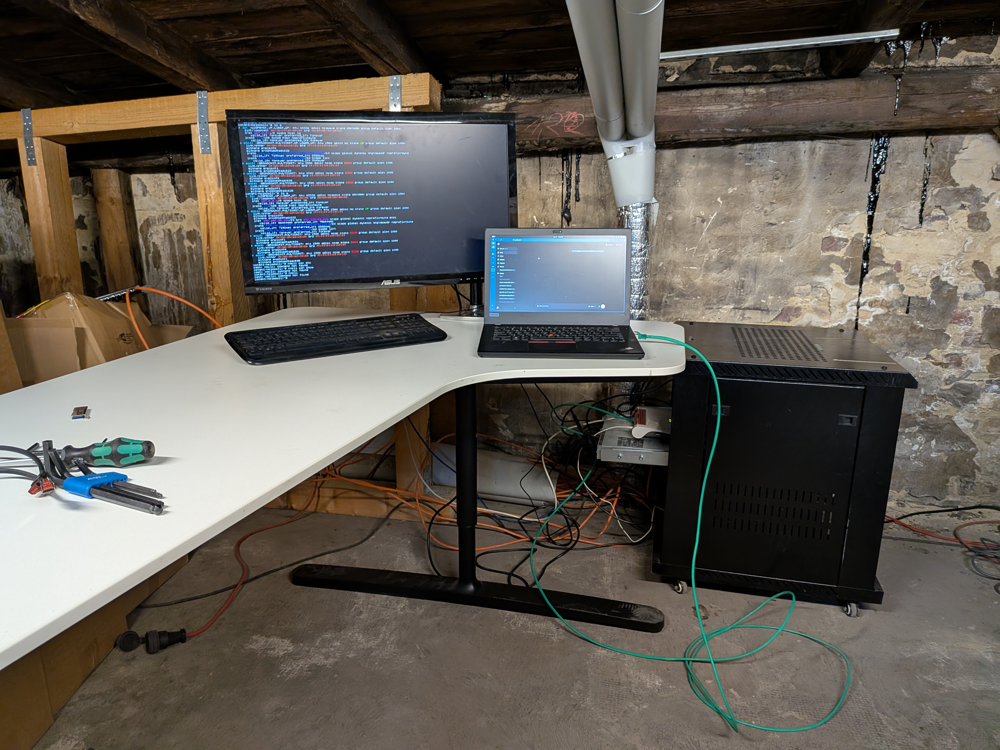

Irgendwann reicht eine Internetleitung nicht mehr. Bei uns war der Punkt erreicht, als 15 Leute gleichzeitig im Büro arbeiteten und die Verbindung spürbar träge wurde — Video-Calls, Git-Pushes, Remote-Zugriffe, alles auf einer Leitung. [Philipp](https://x.com/philippthecron) und ich haben das im Februar angegangen.

Philipp ist unser Serveradministrator — noch im Bachelor-Studium, aber in dem was er tut bereits auf einem Level, das viele Berufsadmins weit hinter sich lässt. Wir haben gemeinsam schon Mesh-Backhauls aufgebaut, VPNs, Intranets, einen Kubernetes-Cluster, Ceph-Storage, Keycloak für alle unsere betriebsinternen Services — und noch deutlich mehr. Wenn bei uns irgendwo ein Dienst läuft, hat Philipp ihn mit aufgebaut oder kennt jeden Winkel davon. Das Netzwerk-Update im Februar war ein weiteres Kapitel in einer langen Liste.

## Die Ausgangslage

Unser bestehendes Netz war klassisch aufgebaut: ein Uplink, dahinter Backbone-Switches, alles läuft drüber. Funktioniert — bis es nicht mehr funktioniert. Entweder weil die Bandbreite ausgeht oder weil der Provider mal einen schlechten Tag hat. Beides hatten wir.

Die Lösung war naheliegend: einen zweiten Uplink ergänzen. Als zweite Leitung haben wir uns für **Starlink** entschieden — schnell zu installieren, keine Abhängigkeit vom gleichen Provider wie die Festleitung, und für unsere Situation geografisch gut geeignet.

Das eigentliche Ziel war Ausfallsicherheit: Wenn eine Leitung wegbricht, soll der Betrieb weitergehen — ohne dass jemand eingreifen muss.

## Heimdall

Zwischen den Uplinks und den bestehenden Backbone-Switches haben wir einen neuen kleinen Schrank eingebaut. Darin: ein Debian Rack-PC, Hostname **AI-heimdall**.

Der Name ist kein Zufall. Odin Holmes — mit dem ich seit Jahren zusammenarbeite und der zu unserem engsten Kreis gehört — hat dafür gesorgt, dass bei uns nordische Namen Tradition haben. Die erste Library, die Odin und ich gemeinsam geschrieben haben, hieß **Kvasir**. Seitdem kleben an manchen unserer Projekte und Maschinen Namen aus der nordischen Mythologie. Heimdall — der Wächter der Götter, der alle neun Welten im Blick behält und jeden Eindringling bemerkt — war für den Eingang ins Firmennetz zu naheliegend, um ihn zu ignorieren.

Auf AI-heimdall laufen die zwei Uplinks als separate Interfaces rein: `eno1` für den DSL-Anschluss (statische IP ins Modem), `eno2` für Starlink per DHCP. Das interne Netz hängt an `eno4` mit dem `10.42.0.0/16`-Adressraum Richtung Backbone-Switches.

Die Routing-Konfiguration nutzt zwei Default-Routen in der Linux-Haupttabelle, unterschieden durch ihre Metrik: DSL läuft mit niedrigerer Metrik und wird bevorzugt, Starlink steht mit Metrik 1003 als zweite Route daneben. Solange DSL erreichbar ist, geht der gesamte Traffic darüber. Fällt der DSL-Gateway weg, übernimmt Starlink automatisch — kein manuelles Eingreifen, kein sichtbarer Ausfall für die Nutzer.

Für die Zukunft sind in `/etc/iproute2/rt_tables` bereits zwei benannte Tabellen angelegt — `starlink` (200) und `dsl` (201) — als Vorbereitung für echtes Policy Routing, das Verbindungen gezielt über einen bestimmten Uplink leitet. Aktuell ist das Failover-Modell aber genau das, was wir brauchen.

## Das Dashboard

Um zu sehen, was gerade über welche Leitung läuft, habe ich ein kleines Python-Dashboard gebaut. Es liest die Schnittstellenstatistiken beider Uplinks aus und zeigt Durchsatz und Auslastung in Echtzeit an — einfach genug, um es auf einem Bildschirm im Büro laufen zu lassen.

Das war auch der praktische Test dafür, dass beide Leitungen tatsächlich genutzt werden: Im Dashboard sieht man, wenn alles über einen Uplink läuft — und man erkennt sofort, wenn etwas nicht stimmt.

## Was es gebracht hat

Die Engpässe sind weg — und wenn der DSL-Anschluss mal kurz zickt, merkt es im Büro niemand. Das ist der eigentliche Gewinn: nicht mehr Bandbreite auf dem Papier, sondern Zuverlässigkeit im Alltag.

Die eigentliche Arbeit war die saubere Integration auf AI-heimdall: zwei Interfaces, korrekte Metrik-Konfiguration, sicherstellen dass die DHCP-Lease von Starlink keine Default-Route in die main-Tabelle schreibt, die DSL verdrängt. Philipp hat den Starlink-Teil aufgebaut, die physische Installation übernommen und kennt jeden Winkel des restlichen Netzes, auf das AI-heimdall jetzt aufbaut; die Routing-Konfiguration war mein Part.

---

*Wer ähnliches aufbaut: Zwei Default-Routen mit unterschiedlicher Metrik in `/etc/network/interfaces` reichen für sauberes Failover. Wer echtes per-Host-Load-Balancing will, braucht zusätzlich `ip rule`-Einträge auf benannte Routing-Tabellen — das ist der nächste Schritt, den wir mit den bereits angelegten Tabellen `starlink` und `dsl` noch angehen werden.*
