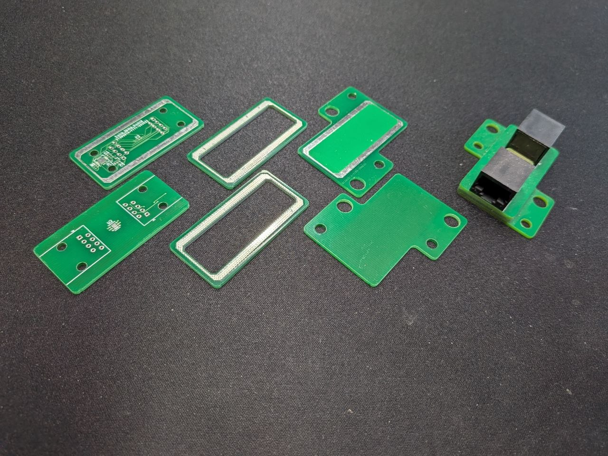

Five years ago [Odin Holmes](https://x.com/odinthenerd) and I filed a utility model at the German Patent and Trade Mark Office. The registration number is DE202020106111U1, the official title is *Leiterplattengehäusevorrichtung mit wenigstens drei gehäusebildenden Leiterplattenelementen* — which is how you have to phrase things for the authorities — and the idea behind it is this: you do not need a separate enclosure if the PCB stack itself *is* the enclosure.

We call it **Enclosureless Cases**.

## The Problem

Sensors are cheap. A BME280 humidity and temperature chip costs well under a euro. A simple microcontroller to go with it costs similarly little. You can put together a capable sensing node for five or six euros in components.

Then you need to put it somewhere.

A plastic injection-moulded enclosure, even a simple one, adds cost. It needs tooling. It needs a second supply chain. It adds assembly steps. It takes up space. And if you are not producing millions of units, you are either paying for tooling that does not amortise, buying an off-the-shelf enclosure that does not quite fit, or spending engineering time on compromises.

We ran into this problem with a 1-Wire temperature and humidity sensor — a device whose electronics genuinely cost around five euros. A separate enclosure at even half that cost already represents a ten percent overhead on the bill of materials. At scale, or in applications with many measurement points — think a cooling vehicle with dozens of compartments, or a control cabinet with sensors throughout — that overhead compounds into real money.

The question we asked was: what if we just did not have a separate enclosure at all?

## The Idea

A printed circuit board already has a rigid, flat body made of FR4. It has copper layers. It has a well-defined planar geometry. And crucially: PCB manufacturing has become extraordinarily cheap and accessible over the past two decades.

My first PCB order — designed in an expensive CAD tool I borrowed from a university licence — cost around 600 euros, took weeks, and came back with an error on it anyway. Before that I used to etch my own boards, which was cheaper but slower and produced worse results. That world is gone. Today a small production run of a simple board costs a few euros per piece and arrives in days.

The Enclosureless approach takes three or more PCBs and turns them into a sealed housing:

- **Bottom PCB** (11.1 in the patent drawings): a flat board with mounting tabs and holes for installation. This is what attaches the device to its mounting point — a control cabinet rail, a vehicle chassis, whatever the application requires.
- **Intermediate frame PCB** (11.2): a frame-shaped board with a rectangular cutout in the centre. It sits between the bottom and top boards and defines the height of the internal cavity. Want a taller cavity? Use two frames. Want to scale the volume? Add more frames or change their thickness.
- **Top PCB** (11.3): the board that carries the actual electronics — the sensor chip, the microcontroller, the connector.

The three layers are stacked and joined by a **continuous peripheral solder joint** — a umlaufende Lötzinn-Bahn running around the entire perimeter of each interface. This joint is what makes the stack a housing: it seals the internal cavity against moisture and dust, and because it is a closed metallic loop, it also provides **electromagnetic shielding** — effectively a Faraday cage integrated into the manufacturing process at no additional cost.

## How It Is Made

The solder joint is applied using a standard reflow process. We use a jig — a metal fixture that holds the stack in alignment during soldering. The process is partly manual in our current setup, but it is compatible with standard PCBA lines. The solder paste goes on the connecting surfaces, the boards are stacked, the jig holds them, and the assembly goes through the oven on a conventional temperature profile.

One consequence of building the enclosure this way: you can integrate the housing manufacturing directly into the PCBA production run. No separate enclosure parts. No second assembly step. No additional logistics.

The first time we tried it, it worked more easily than we expected. The patent application process was, honestly, the hardest part.

## What We Built With It

The first Enclosureless product was a **1-Wire temperature and humidity sensor** based on a BME chip. It measures temperature and relative humidity, communicates over the 1-Wire bus, and fits into installations where you want many measurement points on a single cable run. We also built a **USB-to-1-Wire adapter** using the same approach — a compact interface device housed entirely within its own PCB stack.

Both are available to order directly from us at 12 euros per unit for the sensor. If you want to evaluate the concept before committing to anything, that is the easiest path.

**Datasheet — 1-Wire Temp/Humid sensor:**

<iframe src="assets/Datenblatt 1-Wire Temp.pdf" width="100%" height="600px" style="border:1px solid #ccc; border-radius:4px;"></iframe>

**Mechanical drawing — 1-Wire Temp/Humid sensor:**

<iframe src="assets/Zeichnung 1-Wire Temp.pdf" width="100%" height="600px" style="border:1px solid #ccc; border-radius:4px;"></iframe>

## The Geometry

The base footprint in the reference design is 45 × 35 mm. Total height is 18.9 mm including the connector. Mounting holes are positioned for direct rail or panel mounting. The internal cavity scales with the number of intermediate frames — one frame gives you a cavity the height of one PCB thickness, seven frames is about the practical upper limit before the stack starts to exhibit visible warping under the thermal load of soldering.

The perimeter solder joint runs completely around the inside edge of each frame, flush with the board surfaces. In the patent drawings this is labelled 17.1. The Faraday effect of this joint is particularly effective when the boards are in a coplanar congruent arrangement — the two continuous metallic loops form a closed electromagnetic shield around the cavity contents.

## The Utility Model

The German Gebrauchsmuster DE202020106111U1 was filed on 26 October 2020 and registered on 5 November 2020. It covers the core concept: a housing device formed exclusively from at least three PCB elements, sealed by a continuous irreversible connection — specifically a solder joint — running around the full perimeter of each interface.

**Gebrauchsmusterschrift DE202020106111U1:**

<iframe src="assets/DE202020106111U1.pdf" width="100%" height="800px" style="border:1px solid #ccc; border-radius:4px;"></iframe>

The Gebrauchsmuster is still active. We are happy to license it commercially — if you want to use Enclosureless Cases in a product, get in touch and we will work something out. **Non-commercial use is free.** Build it, teach with it, experiment with it, publish about it. If you want the data — Gerber files, board layouts — we will send them to you. We have not gone the full OSHW route, but we do not keep the files locked away either.

## The Cost Argument

The total cost of an Enclosureless device is essentially the cost of the PCBs from your manufacturer. There is no enclosure line item. No tooling. No secondary assembly. The scaling behaviour is also different from conventional housing: because the housing and the electronics are ordered from the same supplier in the same process, the cost per unit at small volumes is much closer to the cost at large volumes than with traditional enclosures, where tooling amortisation dominates the early pricing.

At the application level — a Kühlfahrzeug with fifty compartments, or a control cabinet with dozens of measurement points — the difference between a five-euro and a twelve-euro enclosure per node adds up to something worth engineering around.

## If You Want to Build One

The concept is simple enough to implement without our involvement. You need:

1. Three PCBs with a continuous solder-paste pad running around the full inner perimeter of the interface surfaces — pre-applied as a standard solderable surface in the PCB design
2. A fixture to hold alignment during reflow
3. A standard reflow oven

The frame PCB is the key element: it defines the cavity volume and carries no active components. Its sole structural function is to space the top and bottom boards and provide the two connecting solder surfaces. It can be designed in any KiCad-compatible workflow as a simple rectangular cutout with a perimeter pad.

If you want the reference design files rather than starting from scratch, reach out. The geometry is documented in the Gebrauchsmuster figures and in our internal datasheets, but the actual production files are the faster starting point.

---

*Auto-Intern GmbH is based in Bochum. The 1-Wire Temp/Humid sensor and the USB-to-1-Wire adapter are available to order. Licensing enquiries and data requests can go to [stephan.boekelmann@gruppe.ai](mailto:stephan.boekelmann@gruppe.ai).*
