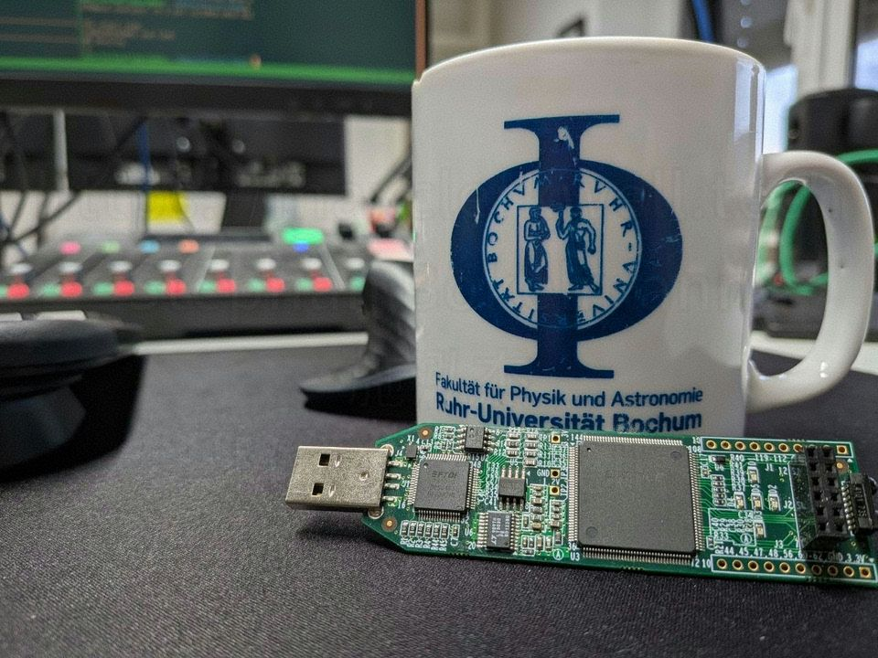
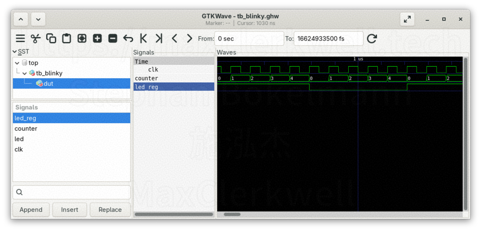

This post is the first in a series on FPGA development with open-source tools. By the end you will have blinked an LED on real hardware, and you will understand every step between writing the VHDL source and the moment the LED actually blinks.

No prior HDL experience is assumed. If you know what a for-loop is, you have enough background.

---

## What is an FPGA, and why does it matter?

A microcontroller runs a program. An FPGA does something fundamentally different: you describe a circuit, and the chip reconfigures its internal wiring to *become* that circuit.

There is no instruction fetch, no program counter, no interrupt latency hidden somewhere in a HAL. Logic runs in parallel the way physics demands — because it *is* physics. Two AND gates compute simultaneously not because a scheduler allows it, but because there is no reason they cannot.

This is not faster software. It is a different thing entirely.

**VHDL** (Very High Speed Integrated Circuit Hardware Description Language) is one of the two mainstream languages for describing that circuit. The other is Verilog. VHDL has a reputation for verbosity, which is mostly fair, but it also has a strict type system and an IEEE standard that has held together since 1987. It rewards discipline.

---

## The hardware: Lattice iCEstick HX1K

The iCEstick is a USB-A stick with a **Lattice iCE40HX1K** FPGA on it. It costs around $25, plugs directly into a USB port, and has five green LEDs (D1–D5), a 12 MHz oscillator, and an FTDI chip for programming. No external power supply, no JTAG adapter, no soldering.

The iCE40 family is also the reason a fully open-source FPGA toolchain exists. In 2015, Clifford Wolf reverse-engineered the iCE40 bitstream format, which made it possible to write `iceprog`, `icepack`, and eventually the full IceStorm project. Everything used here — GHDL, Yosys, nextpnr, IceStorm — is open-source and packaged in Debian.

---

## Toolchain overview

Before writing a single line of VHDL, it helps to know what each tool does and why it is in the chain.

| Tool | Role |
|---|---|
| **GHDL** | Analyses and simulates VHDL. Can also synthesise VHDL to structural Verilog. |
| **GTKWave** | Opens the waveform files that GHDL produces. Lets you inspect signal values over time. |
| **Yosys** | Takes Verilog (or GHDL's output) and performs RTL synthesis: logic optimisation and technology mapping onto iCE40 primitives. |
| **nextpnr-ice40** | Place and Route. Assigns the synthesised logic cells to physical resources in the chip, routes the connections, and checks timing. |
| **icepack** | Converts nextpnr's human-readable ASCII bitstream to the binary format the chip expects. |
| **iceprog** | Writes the binary bitfile to the iCEstick's SPI flash over USB. |

The complete flow is: **VHDL → GHDL synth → Verilog → Yosys → JSON netlist → nextpnr → ASC bitstream → icepack → BIN → iceprog → iCEstick**.

Install everything on Debian:

```bash
sudo apt install ghdl gtkwave yosys nextpnr-ice40 icestorm make
```

### USB permissions

`iceprog` needs write access to the FTDI chip. Without root, add a udev rule:

```bash
echo 'ATTRS{idVendor}=="0403", ATTRS{idProduct}=="6010", MODE="0660", GROUP="plugdev"' \
  | sudo tee /etc/udev/rules.d/53-lattice-icestick.rules
sudo udevadm control --reload-rules
sudo usermod -aG plugdev $USER
newgrp plugdev
```

---

## The design: a 1 Hz LED blinker

The goal is simple: LED D1 turns on for 500 ms, off for 500 ms, on for 500 ms, forever. The onboard oscillator provides a 12 MHz clock.

500 ms at 12 MHz means 6,000,000 clock cycles. So we need a counter that counts to 6,000,000, toggles the LED, and resets. That counter *is* the entire design.

### `src/blinky.vhd`

```vhdl
library ieee;
use ieee.std_logic_1164.all;
use ieee.numeric_std.all;

entity blinky is
    generic (
        DIVISOR : positive := 6_000_000
    );
    port (
        clk : in  std_logic;
        led : out std_logic
    );
end entity blinky;

architecture rtl of blinky is
    signal counter : integer range 0 to DIVISOR/2 - 1 := 0;
    signal led_reg : std_logic := '0';
begin
    process(clk)
    begin
        if rising_edge(clk) then
            if counter = DIVISOR/2 - 1 then
                counter <= 0;
                led_reg <= not led_reg;
            else
                counter <= counter + 1;
            end if;
        end if;
    end process;

    led <= led_reg;
end architecture rtl;
```

**Walking through this line by line:**

`entity blinky` declares the module's interface to the outside world: a generic parameter `DIVISOR` (which defaults to 6,000,000 but can be overridden) and two ports, `clk` in and `led` out.

Generics are VHDL's equivalent of template parameters or compile-time constants. Changing `DIVISOR` from 6,000,000 to 10 in the testbench lets the simulation finish in 20 clock cycles instead of 120,000,000.

`architecture rtl` is where the behaviour lives. The name `rtl` is convention — it stands for Register Transfer Level, meaning we are describing how data moves between registers.

`signal counter` is an internal state variable constrained to the range `0 to DIVISOR/2 - 1`. The synthesiser uses this range to calculate the minimum number of flip-flops needed.

`signal led_reg` is the flip-flop that drives the LED. We drive the LED from a data register, not a clock net. This matters: routing a toggling signal through the global clock buffer network would be incorrect practice.

The `process(clk)` block describes sequential logic. Everything inside it is evaluated on every rising edge of `clk`. VHDL uses `<=` for signal assignment inside processes; the effect is deferred to the end of the simulation delta cycle, which is how hardware actually behaves.

When `counter` reaches its maximum, it resets to zero and `led_reg` inverts. Otherwise the counter increments. At the bottom of the architecture, `led <= led_reg` connects the output port to the register.

---

## Simulation before hardware

A key habit in hardware design: simulate before you flash. Flashing takes time, and a broken bitfile on hardware gives you almost no diagnostic information. A simulation gives you every signal value at every point in time.

### `sim/tb_blinky.vhd`

```vhdl
library ieee;
use ieee.std_logic_1164.all;
use ieee.numeric_std.all;

entity tb_blinky is
end entity tb_blinky;

architecture sim of tb_blinky is
    signal clk : std_logic := '0';
    signal led : std_logic;
begin
    -- Instantiate the design under test with a tiny DIVISOR so it toggles fast
    uut : entity work.blinky
        generic map (DIVISOR => 10)
        port map (clk => clk, led => led);

    -- Generate a 12 MHz clock: period = 83,333 ps ≈ 83 ns
    clk <= not clk after 41666 ps;

    -- Stop after 200 clock cycles
    process
    begin
        wait for 200 * 83333 ps;
        std.env.stop;
    end process;
end architecture sim;
```

The testbench is itself a VHDL entity — one with no ports, because it is the top of the hierarchy and nothing connects to it from outside. It instantiates `blinky` with `DIVISOR => 10`, so the LED toggles every 5 clock cycles instead of every 6,000,000. The clock generator uses concurrent signal assignment: `clk <= not clk after 41666 ps` reschedules itself indefinitely, producing a 83.332 ps period (≈ 12 MHz).

### Running the simulation

```bash
# Analyse both source files into the work library
ghdl -a src/blinky.vhd sim/tb_blinky.vhd

# Elaborate the top-level entity
ghdl -e tb_blinky

# Run and dump waveforms
ghdl -r tb_blinky --wave=sim/tb_blinky.ghw

# Open the waveforms
gtkwave sim/tb_blinky.ghw sim/tb_blinky.gtkw
```

Or just `make sim` if you have the Makefile.

GTKWave opens with the waveform file loaded, but the wave view starts empty. You have to tell it which signals you want to see. The left panel is the **SST** — Signal Search Tree — which mirrors the hierarchy of your VHDL design. Expand `top → tb_blinky` and click on `dut` to select the design under test. The **Signals** panel below the tree then lists every signal inside that entity: `led_reg`, `counter`, `led`, `clk`.

Select the signals you want, then click **Append** at the bottom to add them to the wave view. You can also double-click a signal directly. Once they appear in the Signals column on the right, the waveforms render.



What you see: `clk` toggling at 12 MHz, `counter` incrementing from 0 to 4 (because `DIVISOR=10`, so `DIVISOR/2 - 1 = 4`), and `led_reg` flipping every time the counter wraps — exactly as designed. The `.gtkw` save file in the repo pre-configures this layout so you do not have to repeat the SST navigation every time.

---

## Synthesis and flashing

Once simulation looks correct, synthesis converts the VHDL description into a physical implementation on the chip.

### Pin constraints: `constraints/icestick.pcf`

```
set_io clk  21   # Onboard 12 MHz oscillator
set_io led  99   # LED D1 (green, rightmost)
```

The Physical Constraints File maps logical port names to physical FPGA pin numbers. These numbers come from the official iCEstick schematic. Pin 21 is where Lattice wired the oscillator output; pin 99 is where LED D1's anode connects (through a current-limiting resistor). If you ever use a different iCE40 board, this file is the thing to change.

### The Makefile

```makefile
VHDL_SRC   = src/blinky.vhd
SIM_SRC    = sim/tb_blinky.vhd
TB         = tb_blinky
WAVE       = sim/$(TB).ghw
GTKW       = sim/$(TB).gtkw
PCF        = constraints/icestick.pcf

.PHONY: sim synth flash clean

sim: $(VHDL_SRC) $(SIM_SRC)
	ghdl -a $(VHDL_SRC) $(SIM_SRC)
	ghdl -e $(TB)
	ghdl -r $(TB) --wave=$(WAVE)
	gtkwave $(WAVE) $(GTKW)

synth: $(VHDL_SRC)
	ghdl synth --out=verilog -e blinky $(VHDL_SRC) > blinky.v
	yosys -p "synth_ice40 -top blinky -json blinky.json" blinky.v
	nextpnr-ice40 --hx1k --package tq144 \
	    --json blinky.json --pcf $(PCF) --asc blinky.asc
	icepack blinky.asc blinky.bin

flash: blinky.bin
	iceprog blinky.bin

clean:
	rm -f *.o *.cf *.v *.json *.asc *.bin $(TB) $(WAVE)
```

Run `make synth` and watch the toolchain work through all five stages. The nextpnr output is worth reading:

```
Max frequency for clock 'clk$SB_IO_IN_$glb_clk': 168.75 MHz
Required: 12.00 MHz
→ PASS  (ample slack)
```

The design could run at nearly 169 MHz. At 12 MHz we have so much timing slack that the place-and-route constraints are trivially satisfied. This makes sense: a counter and a toggle register are about the simplest thing an FPGA can do.

Connect the iCEstick, then `make flash`. The USB FTDI chip handles the SPI protocol that loads the bitfile into the iCEstick's configuration flash. The FPGA reads that flash on every power-on and reconfigures itself. From this point on, the LED blinks every time you plug the stick in — no software, no bootloader, no operating system.

---

## Seeing it run

<div style="position: relative; padding-bottom: 56.25%; height: 0; overflow: hidden; max-width: 100%; margin: 1.5rem 0;">
  <iframe
    src="https://www.youtube.com/embed/krhzkKBwpC0"
    title="FPGA Blinky — VHDL on iCEstick"
    style="position: absolute; top: 0; left: 0; width: 100%; height: 100%; border: 0;"
    allow="accelerometer; autoplay; clipboard-write; encrypted-media; gyroscope; picture-in-picture"
    allowfullscreen>
  </iframe>
</div>

LED D1, blinking at exactly 1 Hz, powered by 24 flip-flops and a handful of LUTs.

---

## What just happened

The LED is blinking because you described a circuit and the FPGA became that circuit.

There is no CPU fetching instructions. The counter increments because 24 flip-flops are wired in a specific pattern, and that pattern advances on every clock edge because the oscillator is running. The comparator that detects `counter = DIVISOR/2 - 1` is a few LUTs (Look-Up Tables) whose truth tables were written into the configuration flash alongside the routing information.

This is what the entire synthesis pipeline produced: a configuration of flip-flops, LUTs, and routing multiplexers inside the iCE40 that implements exactly the behaviour you wrote in VHDL.

---

## Known limitations and what comes next

A few things worth knowing before you build on this:

- **`DIVISOR` must be even.** The counter only reacts on the rising edge. An odd divisor produces a non-50% duty cycle because the high half and the low half have unequal lengths. 6,000,000 is even, so hardware is fine.
- **The LED is not a clock signal.** `led_reg` is driven from a data flip-flop. If you needed a derived clock for other logic, you would use the onboard PLL (`SB_PLL40_CORE`) via `icepll`, not this pattern.
- **Tested on iCEstick HX1K only.** The ICEbreaker and other iCE40 boards require different pin numbers in the `.pcf` and different `--device`/`--package` flags in nextpnr.

Future posts in this series will go deeper: state machines, SPI, the PLL, and eventually communicating back to a host over UART. The same toolchain and the same discipline — simulate first, then flash — applies throughout.

The full source for this post is in the [STEMgraph repository](https://github.com/STEMgraph/e1a74039-1bc0-4385-b76a-8f935494473d).

---

I also post videos from time to time on my [YouTube channel — **@maxclerkwell**](https://youtube.com/@maxclerkwell).
