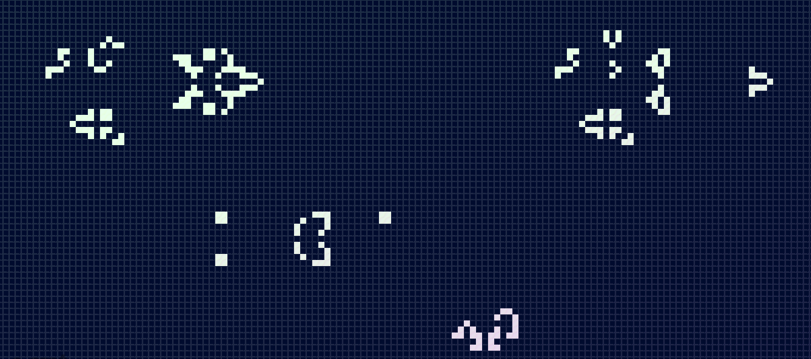

A friend sent me a link to a simulation running in a browser tab: [oimo.io/works/life](https://oimo.io/works/life/). She had heard of it — two colleagues from the physics department had mentioned it. One of them called it "useless math but super fun."

I objected.

It is the complete opposite of useless math. It is one of the most significant discoveries in science.

That conviction is what this post is about.

## Where It Comes From

In the late 1940s and early 1950s, Stanisław Ulam and John von Neumann were close friends and colleagues at Los Alamos, but they were circling the same idea from different angles. Ulam was studying how crystals grow: the way a regular structure can propagate outward from a seed through local interactions alone. Von Neumann was thinking about something more unsettling: machines that could reproduce themselves. What logic would such a machine need? What is the minimum structure that allows a pattern to copy itself faithfully?

The formalism that emerged from this work is called a **cellular automaton**. The name is more intimidating than the thing itself. You start with three ingredients:

1. A grid of cells — one-dimensional or two-dimensional, possibly infinite
2. A starting pattern: the seed
3. A rule that maps each cell's current state to its next state, based on its neighbours

That is the whole apparatus. Everything else follows.

## The Rules

The most famous instance of this framework is John Conway's Game of Life, which he published in 1970. The grid is two-dimensional. Each cell is either alive or dead. At every step, each cell looks at its eight immediate neighbours — the cells touching it, including diagonals — and follows these four simple rules:

A living cell with 0 or 1 neighbours dies. Too lonely.  
A living cell with 2 or 3 neighbours survives.  
A living cell with 4 or more neighbours dies. Overcrowded.  
A dead cell with exactly 3 neighbours becomes alive. Birth.

That is it. Nothing else. You could describe the entire system in a paragraph, which I just did.

And yet if you run it — if you actually sit and watch the patterns unfold — it quickly stops feeling trivial.

## The Classes

In the early 1980s, Stephen Wolfram took the idea of cellular automata and pushed it much further. He exhaustively analysed all 256 possible rules for the simplest one-dimensional CAs and found that their long-run behaviour falls into one of four classes:

1. The grid converges to a uniform, dead state. Everything dies.
2. The grid settles into stable or periodic patterns — a fixed pulse, a repeating loop.
3. Chaotic behaviour: randomness that never resolves.
4. Complex, localised structures that move, interact, and persist.

Class 4 is the interesting one. It is where the Game of Life lives. Structures emerge, collide, produce new structures. There are patterns in the Game of Life that function as logic gates. There are patterns that function as memory. There are patterns that replicate themselves. The GoL is Turing complete — you can, in principle, run any computation inside it using nothing but the four rules above.

This bothered me the first time I really understood it. It still bothers me now.

## Computational Irreducibility

Wolfram explored what this means in his 2002 book *A New Kind of Science*, and one concept from that work has genuinely never left me.

He called it **computational irreducibility**.

When we do physics, we observe a phenomenon, abstract a formula from it, and use that formula to predict future behaviour. A pendulum swings; we write down a differential equation; we evaluate it for any future time *t* without having to simulate every intermediate position. The formula *collapses* the computation. We get to skip ahead.

Wolfram argued — and showed, for specific rules — that for certain systems this is simply impossible. There is no closed formula. There is no shortcut. The only way to know what state the system will be in after a million steps is to run it for a million steps. The simulation cannot be compressed. The future is not analytically accessible from the present.

For the Game of Life specifically: you cannot look at a starting pattern and calculate its state after ten thousand generations without actually computing all ten thousand generations. There is no formula. The universe of the GoL must be *lived through*, not solved.

And that is exactly why the next question feels so unsettling.

## Assuming for a Moment

What if our universe is that kind of system?

Not a metaphor. The actual conjecture: that physical reality is a cellular automaton, or something functionally equivalent to one — a discrete state space evolving by local rules, step by step, producing complexity that no observer inside it can predict without running the whole thing.

Wolfram has spent real effort on this. It is not a casual speculation.

If it is true, then physics as we practise it — observe, abstract, predict — works only in the limited regime where the computation *happens* to be compressible. For simple things, on short timescales, the formulas work. The pendulum, the projectile, the ideal gas. We mistake that compressibility for a general property of nature.

But push far enough into complexity, or far enough into the future, and you hit the irreducibility wall. No equation will get you there. You must simulate.

## The Particle in the Box

Statistical physicists have a word for this wall: entropy.

I think about it this way. Imagine a sealed box with one particle inside. You have unlimited time and unlimited instruments. You measure the particle's position and momentum to whatever precision your instruments allow. You close the box. Time passes.

Where is the particle $10^{-27}$ seconds later? Essentially where you left it.

Where is it 1 second later? Tractable, with some uncertainty from measurement error and from the bouncing geometry.

Where is it $10^{27}$ seconds later? At this point the uncertainty has compounded so severely that your answer covers essentially the entire box. The measurement you made at the start is no longer useful. It has been drowned by the accumulation of error across every collision.

This is entropy, in one framing: in an isolated system, the precision with which you can describe the future state can only decrease over time. You started with a measurement. That measurement ages. Every step forward is a step toward irreducibility.

What I find striking is the shape of this argument. Entropy is usually taught as a thermodynamic concept — heat, disorder, the direction of time. But when I look at it from the side of computational irreducibility, it feels like the same thing stated differently. The system is not yielding its future to analysis. The only way to know where the particle is going to be is to let it go there.

**Maybe entropy is the signature of irreducibility.** Not just a measure of disorder, but a measure of how far ahead the universe refuses to be calculated.

## The Edge of Chaos

I do not know whether I would prefer to live in a universe that is, at bottom, a rule table — a matrix of zeros and ones ticking forward under four constraints that nobody chose.

But if that is what we are, we are clearly in Class 4. Not dead uniformity. Not frozen periodicity. Not meaningless noise.

We are at the edge of chaos, where gliders emerge from noise, structures persist long enough to collide, and something that looks almost like purpose arises from nothing more than local arithmetic.

I looked again at the simulation my friend sent me — endless recursive Life inside Life — and I felt strangely comforted.

I am not sure whether to find that frightening or sufficient.
