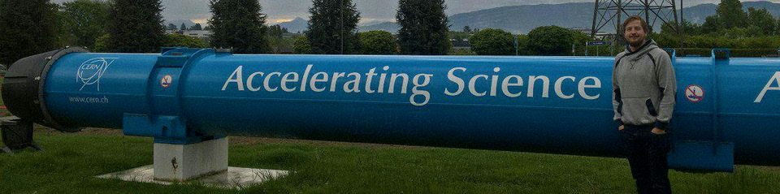

This is the first post on this blog. It won't be the most technically dense — that comes later.

## Why a blog?

Every platform I post on is rented ground. Algorithms change. Accounts get suspended. Platforms rise and fall. This blog is the one place I own outright.

The plan: one longform post per week. Everything else — threads on X, LinkedIn posts, YouTube videos, Instagram carousels — is derived from what's written here first. The blog is the source of truth.

## What this blog covers: monitoring, hardware, and university lectures

Three pillars, based on where I actually spend my time:

**Monitoring systems in production.** I've been building and running measurement infrastructure since 2007 — from oscilloscope-based diagnostics in automotive workshops to telemetry stacks for critical rail infrastructure and particle physics experiments. There's a lot of hard-won knowledge here that doesn't exist in any single book or documentation page.

**University lecture material.** I teach at THGA Bochum. The courses cover programming fundamentals, object-oriented design, and databases. I'll publish supplementary material here — worked examples, extended explanations, things that didn't fit into the lecture slot.

**Company visits.** I travel to electronics manufacturers, fabs, and engineering shops around the world. I want to document what I see — not the PR version, the real version. Factory floors, supply chains, engineering culture.

## Who is MaxClerkwell? The James Clerk Maxwell connection

The username `MaxClerkwell` is a wordplay on **James Clerk Maxwell** — the Scottish physicist who unified electricity, magnetism, and light into a single theory. Rearrange the syllables slightly and you get MaxClerkwell. Seemed appropriate for someone who spends their days connecting layers of the stack that aren't supposed to know about each other.

The tagline — *From tape-out to TypeScript* — is meant to be taken literally. I've worked at every layer: silicon characterization, bare-metal firmware, ASIC test systems, embedded Linux, monitoring daemons, REST APIs, frontend dashboards. The interesting problems usually live at the boundaries between layers.

## How to follow along

- **Blog** (you're here): canonical, weekly
- [**Discord**](https://discord.gg/2BXuUY6hrX): the community layer — join the Full Stack Engineering server
- [**YouTube**](https://youtube.com/@MaxClerkwell): longform videos derived from blog posts
- [**X / Twitter**](https://x.com/maxclerkwell): threads, quick takes

Links to everything are on the [home page](/).

More soon.
