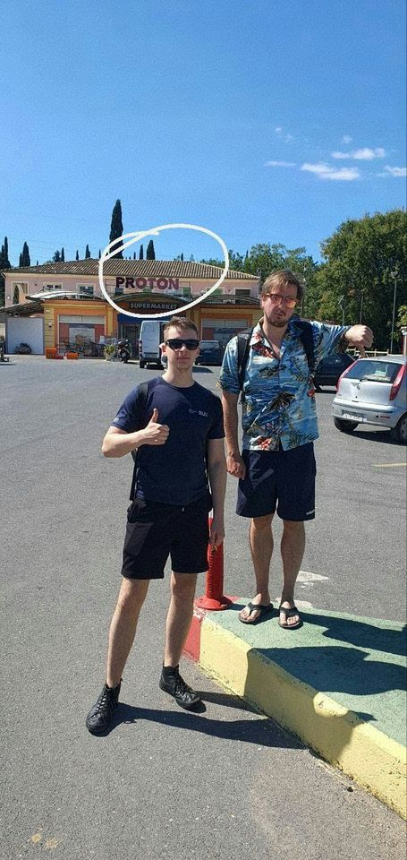
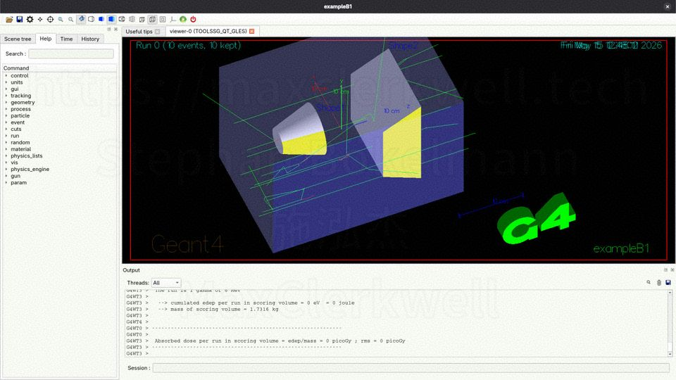
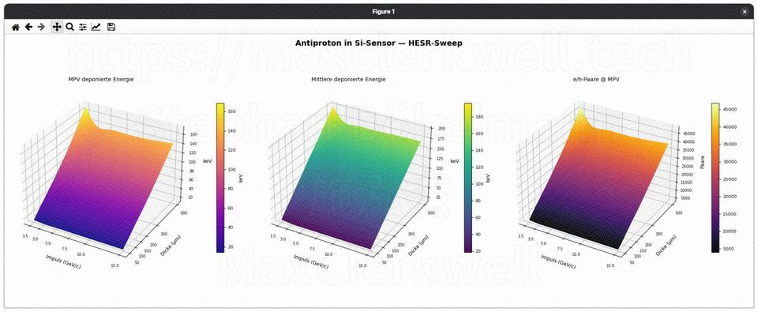
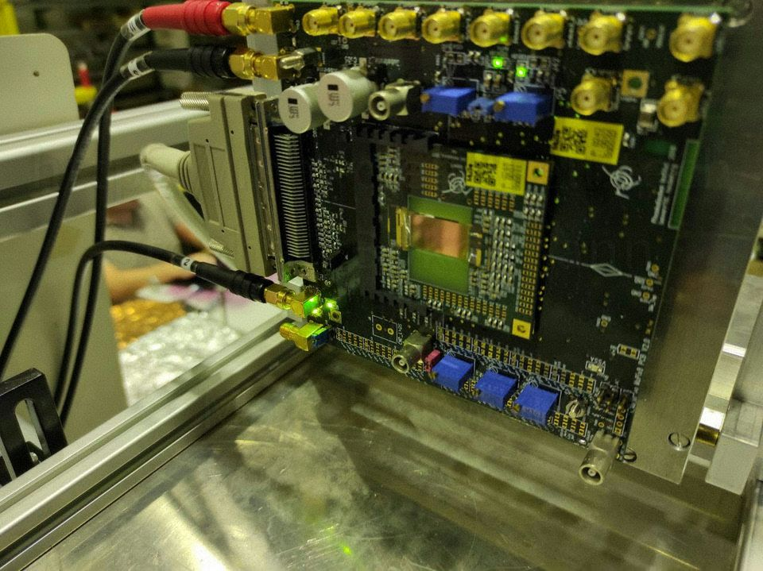
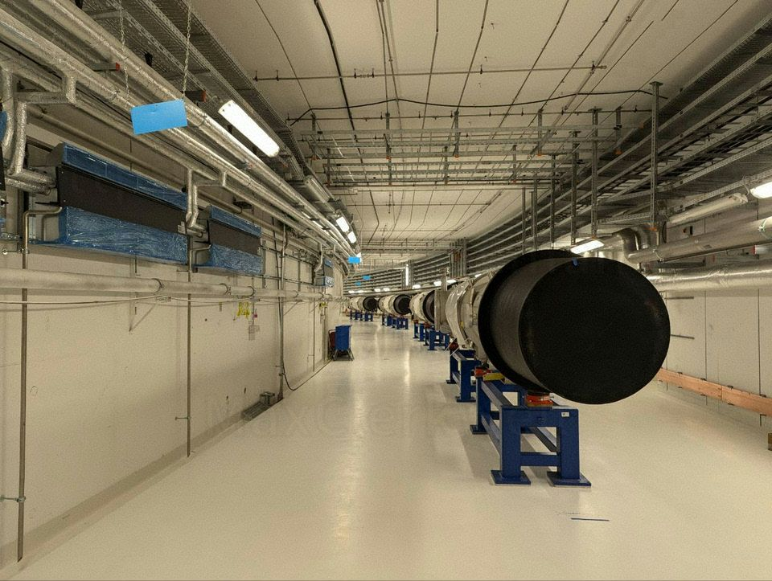

Three years ago, a colleague and I stumbled across a supermarket on Corfu called **PROTON**. I am holding my thumb down in the photo. Team Antiproton does not endorse protons.

That same commitment to antimatter is also why I spent a recent weekend setting up Geant4 to answer a very concrete question: how much energy does an antiproton actually deposit in a silicon pixel sensor as thin as the ones we work with?

---

## What Is HV-MAPS? High Voltage Monolithic Active Pixel Sensors

A conventional hybrid pixel detector is two separate chips glued and bump-bonded together: a sensor chip that collects charge, and a readout ASIC that processes it. HV-MAPS — High-Voltage Monolithic Active Pixel Sensor — collapses both into a single piece of standard CMOS silicon. A high reverse bias voltage (typically 60–120 V) is applied to the substrate, depleting a thin layer directly beneath each pixel cell; ionising particles crossing this depletion zone generate electron-hole pairs that are swept to the collection electrode by the built-in electric field. Because everything lives in one die, the material budget is minimal and no bump-bonding is needed — which matters enormously in tracking detectors where every fraction of a radiation length degrades track resolution.

The foundational work on this concept was published by Ivan Perić et al. and is freely available below:

<object data="assets/IEEE_JSSC_Peric_2007_HVCMOS.pdf" type="application/pdf" width="100%" height="580" style="border-radius:6px; border:1px solid #1a2a4a;">
  <p><a href="assets/IEEE_JSSC_Peric_2007_HVCMOS.pdf">Download the Perić et al. HV-CMOS paper as PDF</a></p>
</object>

If you want more context on how these chips end up on a PCB — including what it actually takes to wire-bond a CLICpix or MuPix die by hand — I gave a talk on exactly that at KiCon Asia 2025: [A poor man's intro to wire bonding](/posts/kicon-asia-2025/).

---

## The question: how much energy does one antiproton deposit?

Before a beam test you want to know what signal to expect. Too little and your threshold swallows it. Too much and you are dealing with a Landau tail that skews your calibration. The answer is not a single number — it is a distribution — and the shape of that distribution depends on both the particle momentum and the sensor thickness.

For the HESR storage ring at FAIR, antiproton momenta range from 1.5 to 15 GeV/c. The sensors we work with are thinned after fabrication to between 50 and 500 µm. That gives a two-dimensional parameter space that is impractical to explore by hand, but before automating anything it is worth doing one case from scratch.

---

## Bethe-Bloch with thin-layer correction: a worked example

The mean energy loss of a heavy charged particle in matter is described by the Bethe-Bloch formula. For thin absorbers — where the number of collisions is small enough that the central limit theorem does not apply — the relevant quantity is not the mean but the **most probable value (MPV)** of the Landau distribution:

$$\Delta E_\text{MPV} = \xi \left[ \ln \frac{2 m_e c^2 \beta^2 \gamma^2}{I} + \ln \frac{\xi}{I} + j - \beta^2 - \delta(\beta\gamma) \right]$$

where

$$\xi = \frac{K}{2} \cdot \frac{Z}{A} \cdot \frac{\rho x}{\beta^2}$$

with $K = 0.307\,\text{MeV mol}^{-1}\text{cm}^2$, and $j = 0.200$ (Landau-Vavilov constant).

**Constants for silicon:**

| Quantity | Symbol | Value |
|---|---|---|
| Atomic number | $Z$ | 14 |
| Atomic mass | $A$ | 28.09 g/mol |
| Density | $\rho$ | 2.329 g/cm³ |
| Mean excitation energy | $I$ | 173 eV |
| Density correction | $\delta$ | (relativistic, see below) |

**Kinematics for a 10 GeV/c antiproton:**

The antiproton rest mass is $m_{\bar{p}} = 938.3\,\text{MeV}/c^2$.

$$p = 10\,\text{GeV}/c \implies \gamma\beta = \frac{p}{m_{\bar{p}}c} = \frac{10000\,\text{MeV}}{938.3\,\text{MeV}} \approx 10.66$$

$$\beta = \frac{\gamma\beta}{\sqrt{1 + (\gamma\beta)^2}} \approx \frac{10.66}{\sqrt{1 + 113.6}} \approx 0.9956$$

$$\gamma \approx 10.71$$

**Step 1 — compute $\xi$ for $x = 100\,\mu\text{m} = 0.01\,\text{cm}$:**

$$\xi = \frac{0.307}{2} \cdot \frac{14}{28.09} \cdot \frac{2.329 \times 0.01}{0.9956^2} \approx 0.1535 \cdot 0.4984 \cdot 0.02353 \approx 1.80 \times 10^{-3}\,\text{MeV}$$

**Step 2 — density correction $\delta$:**

At $\beta\gamma \approx 10.66$ silicon is well into the relativistic rise. Using the standard Sternheimer parametrisation for Si, $\delta \approx 4.5$ at this momentum.

**Step 3 — MPV:**

$$\ln \frac{2 m_e c^2 \beta^2 \gamma^2}{I} = \ln \frac{2 \times 0.511 \times 10^6\,\text{eV} \times 0.9912 \times 114.5}{173\,\text{eV}} \approx \ln(6.72 \times 10^6) \approx 15.72$$

$$\ln \frac{\xi}{I} = \ln \frac{1.80 \times 10^3\,\text{eV}}{173\,\text{eV}} \approx \ln(10.40) \approx 2.34$$

$$\Delta E_\text{MPV} = 1.80 \times 10^{-3} \cdot \left[ 15.72 + 2.34 + 0.20 - 0.991 - 4.5 \right]\,\text{MeV}$$

$$\Delta E_\text{MPV} \approx 1.80 \times 10^{-3} \times 12.77\,\text{MeV} \approx 23\,\text{keV}$$

At 3.6 eV per electron-hole pair in silicon that is roughly **6 400 e/h pairs** — enough to trigger a well-designed pixel, but only barely, and the Landau tail will push some events an order of magnitude higher.

This is one point in a two-dimensional space. If you want to sweep momentum from 1.5 to 15 GeV/c and thickness from 50 to 500 µm, doing this by hand becomes unreasonable very quickly.

---

## Before Geant4: a Python tool

About six years ago I wrote a small Python script to automate exactly this calculation — a Bethe-Bloch evaluator with the Vavilov-Landau thin-layer correction for arbitrary momentum and thickness. It was built partly on older code by [Miriam Fritsch](https://www.researchgate.net/profile/Miriam-Fritsch-2) at Ruhr-Universität Bochum, who works on the PANDA experiment and has been dealing with these numbers far longer than I have. The script did the job: generate a lookup table, estimate thresholds, be done with it.

But an analytic formula — even a correct one — only gives you the most probable value and an approximation of the width. It does not tell you the full shape of the energy deposition distribution, it does not handle secondary particles (delta electrons), and it says nothing about what happens when an antiproton annihilates in the sensor material. For that you need a proper particle transport simulation.

Last weekend I used Geant4 for the first time to replace the Python tool.

---

## Setting up Geant4

Geant4 is not a binary you install and run. It is a C++ framework that you compile from source, then write your own detector description and simulation logic against its API, and compile that too. The setup used here is version 11.4.1. In the commands below, `<installation-dir>` refers to whatever path you built and installed Geant4 into.

**Loading the environment:**

```bash
source <installation-dir>/bin/geant4.sh
```

This sets the library paths and environment variables that CMake and the runtime linker need.

**Building your own simulation:**

```bash
cmake -B build -DCMAKE_BUILD_TYPE=Release
cmake --build build -j$(nproc)
```

The first thing I did after the environment was working was compile the bundled examples — Geant4 ships with a large set of reference simulations covering everything from basic geometry to full calorimeter setups. Compiling these is the sanity check: if they build and produce sensible output, your installation is correct.

Geant4 has a graphical viewer (Qt-based) that you get by running the executable without arguments. I am not usually a fan of GUI tools for this kind of work, but the visualiser is genuinely useful when you are first building a geometry — watching the simulated tracks scatter and stop in the sensor volume makes it immediately obvious if your detector definition is wrong.

<div class="carousel">
  <div class="carousel-track">
    <figure style="scroll-snap-align:start;flex:0 0 100%;margin:0;">
      
      <figcaption style="font-size:0.85em;color:#888;margin-top:0.4em;">Geant4 Qt GUI — exampleB1. The yellow scoring volume and grey detector block are the default geometry. Worth compiling just to confirm the installation is working.</figcaption>
    </figure>
    <figure style="scroll-snap-align:start;flex:0 0 100%;margin:0;">
      
      <figcaption style="font-size:0.85em;color:#888;margin-top:0.4em;">First analysis: MPV deposited energy (left), mean deposited energy (centre), e/h pairs at MPV (right). Axes: antiproton momentum 1.5–15 GeV/c and sensor thickness 50–500 µm.</figcaption>
    </figure>
  </div>
</div>

<style>
.carousel { overflow-x: auto; border-radius: 6px; }
.carousel-track {
  display: flex;
  scroll-snap-type: x mandatory;
  gap: 1rem;
}
</style>

Once the geometry looks right, everything else runs in batch mode via macro files:

```
/pixel/momentum 10.0 GeV
/pixel/thickness 100 um
/pixel/output/setTag myrun
/run/initialize
/run/beamOn 10000
```

---

## What I changed for the HV-MAPS geometry

The starting geometry in the example code is a generic silicon box. To match the chips I actually work with I made the following changes:

- **Sensor area:** 2 cm × 2 cm lateral extent
- **Thickness sweep:** 50 µm to 500 µm in steps — the range we actually use after thinning
- **Particle gun:** antiproton at normal incidence, momentum swept from 1.5 to 15 GeV/c
- **Physics list:** `FTFP_BERT` — this is important. Standard electromagnetic-only lists do not handle antiproton annihilation. `FTFP_BERT` includes hadronic processes and correctly models what happens when an antiproton stops in the material and annihilates with a silicon nucleus, producing a spray of pions and other secondaries that deposit large amounts of energy. If you use the wrong physics list you will miss the high-energy tail entirely.

The thickness range reflects real production. HV-MAPS chips come out of the fab at standard wafer thickness — several hundred microns. They are then thinned by backgrinding before being diced and mounted. The thinned dies end up glued to an evaluation PCB and wire-bonded — the same bonding process I covered in the [KiCon talk](/posts/kicon-asia-2025/). A thinner sensor means less material in the beam, which is good for tracking resolution, but also less ionisation signal, which makes the threshold setting more critical. Simulating across the full thickness range shows exactly where the signal falls below the noise floor.

---

## Simulation Results: The Landau Distribution of Energy Deposition

The output is a CSV histogram of energy deposition per event. After running the sweep across the full HESR momentum range and the expected thickness range, I wrote a short Python script to pull the MPV and mean from each histogram and render the results as 3D surface plots — shown in the carousel above.

The three panels show exactly what you want to know before setting a threshold: how the most probable signal, the mean signal, and the corresponding charge yield change across the whole operating envelope of the HESR.

At 10 GeV/c and 100 µm the distribution is clearly Landau-shaped:

- MPV ≈ 23–27 keV → ~6 500–7 500 e/h pairs
- Mean ≈ 38–42 keV (pulled upward by the Landau tail)
- ~5 % of events deposit more than 100 keV — delta electrons and annihilation products

The mean always overestimates what a typical particle does. For threshold setting, the MPV is the right number. The mean is misleading.

At 50 µm — the thinnest configuration — the MPV drops to roughly 12 keV, around 3 300 e/h pairs. For a pixel with typical noise of a few hundred electrons equivalent, this is workable, but the margin is thin and annihilation events create a tail that can saturate the charge-sensitive amplifier.

---

## What Geant4 does not simulate

Geant4 tracks the particle through the material and records where and how much energy is deposited. It does not simulate what happens to the generated electron-hole pairs afterwards. The built-in electric field of the depleted zone — typically 10⁴ to 10⁵ V/m — drifts those pairs toward the collection electrode, and the induced current on the electrode (the Ramo-Shockley theorem) is what actually becomes the measured signal. None of that is in Geant4.

For the full signal chain — drift, diffusion, charge sharing between pixels, and the induced current waveform — the tool is **Allpix Squared** (developed at CERN and DESY), which uses Geant4 as its particle transport backend and adds solid-state physics on top. That is probably where I will be spending some weekends over the next few weeks.

---

## From simulation to beam test

A simulation tells you what to expect in theory. But before a detector can be installed in its target experiment — which may not even exist yet — it has to be validated at an already-running facility. Detector groups routinely bring their prototypes to whatever beam is available and matches their needs closely enough. We did a significant amount of our characterisation work at **COSY** — the Cooler Synchrotron at Forschungszentrum Jülich, which delivered proton beams up to 3.7 GeV/c. Protons are not antiprotons, but for the purposes of validating the energy deposition model and the detector's threshold response, the difference in the Bethe-Bloch MPV is small at relativistic momenta.



COSY was shut down in 2023 as part of a restructuring of the German accelerator landscape. Its closure leaves a gap that FAIR will eventually fill — but eventually is the operative word.

The SIS100, the superconducting heavy-ion synchrotron at the heart of FAIR, is currently in the installation and hardware commissioning phase. The tunnel is complete, the superconducting dipole magnets are in place, and the cryogenic plant began commissioning in 2025. First beam is currently scheduled for the second half of 2027. The HESR — the antiproton storage ring that PANDA will sit on — comes after that.



The gap between "simulation says this should work" and "we measured it in an antiproton beam" is still several years wide. That is precisely why it is worth understanding the simulation carefully now — and why a weekend spent with Geant4 is time well spent.

A dedicated post on beam test logistics, what a shift actually looks like, and what we learned from COSY will follow separately.
