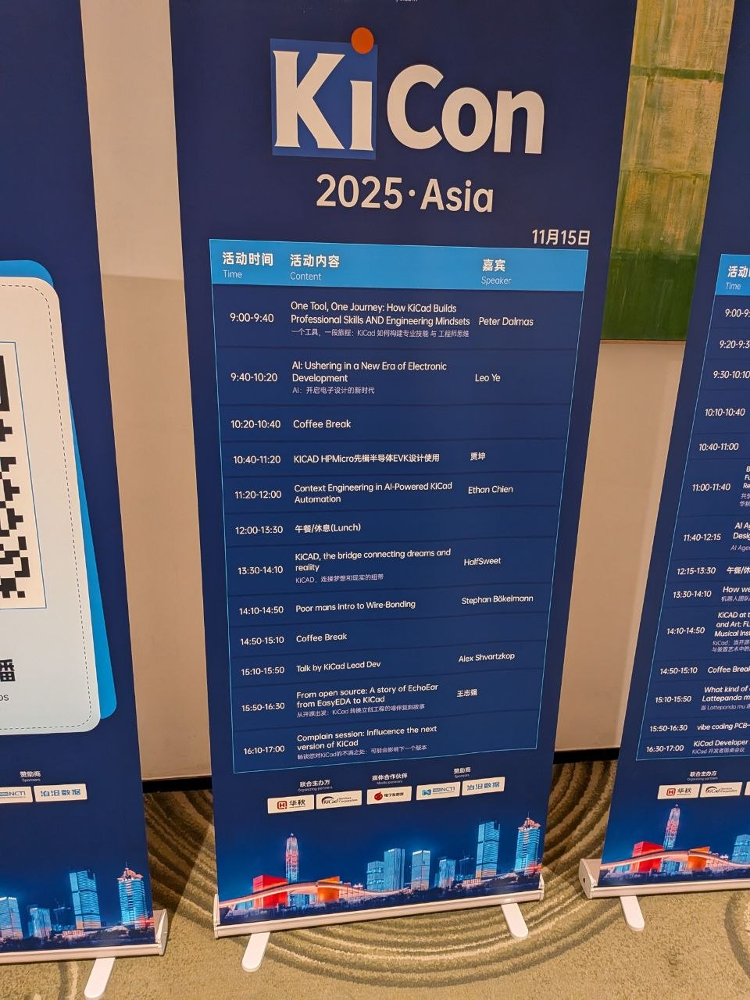
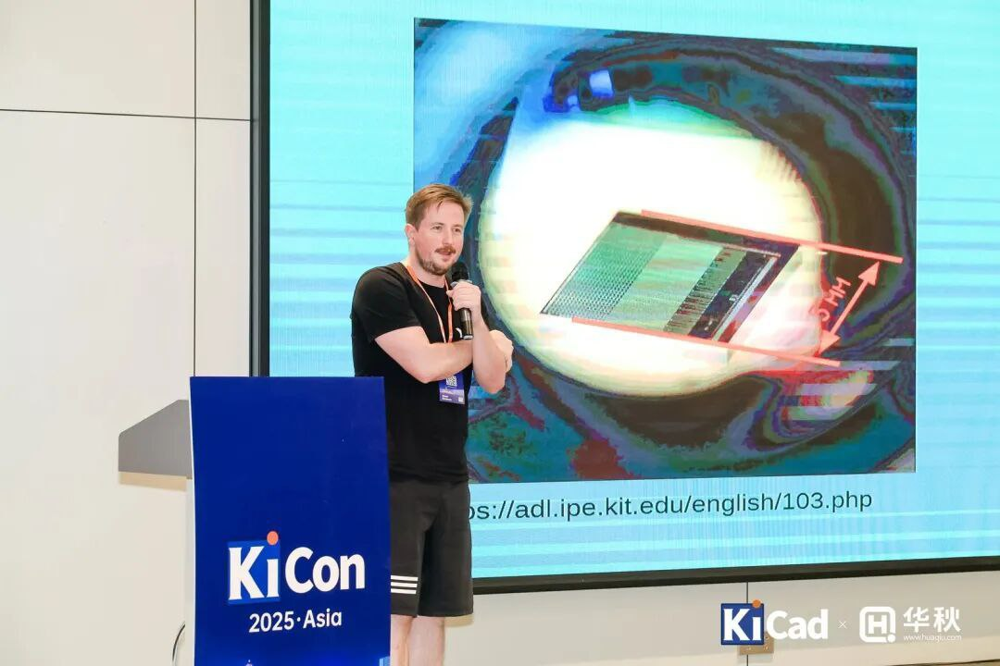
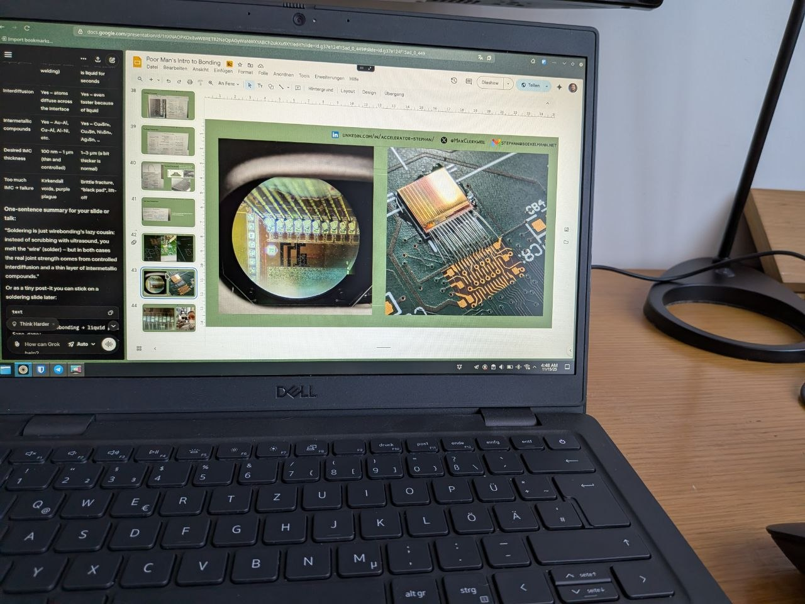
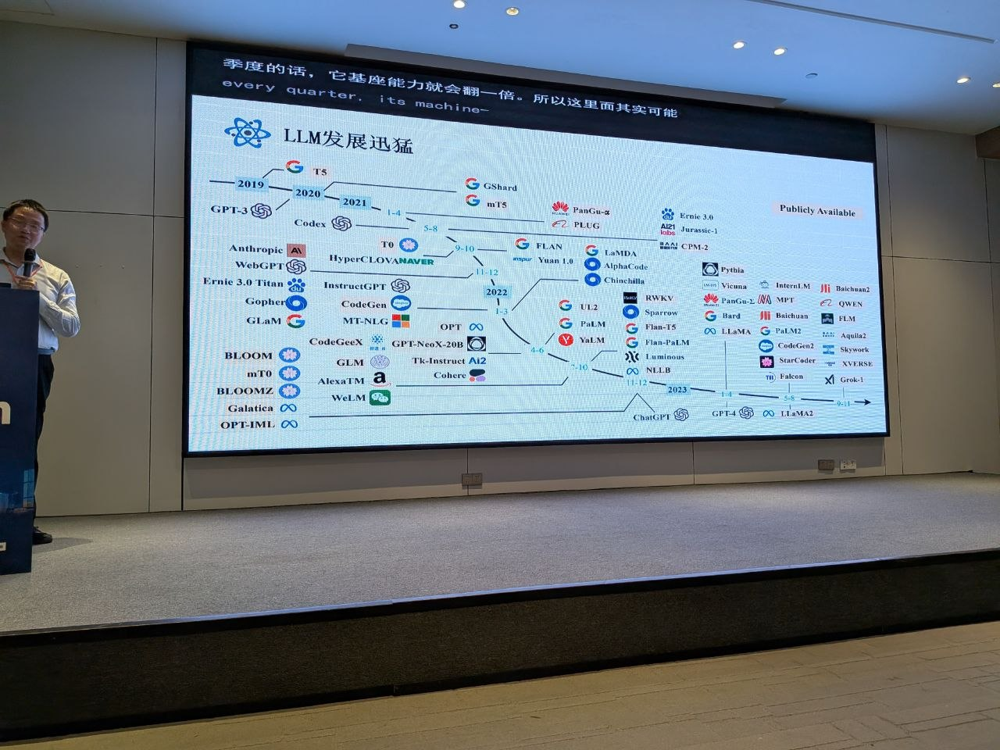
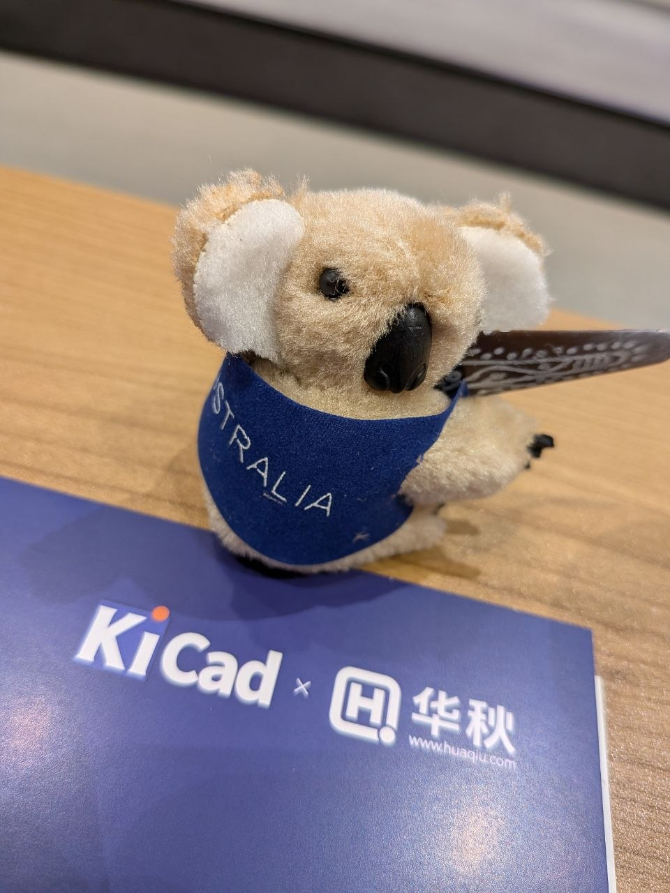
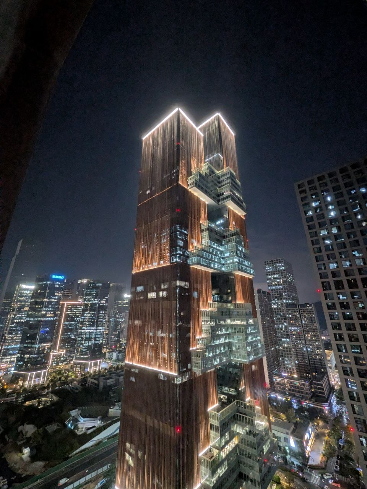
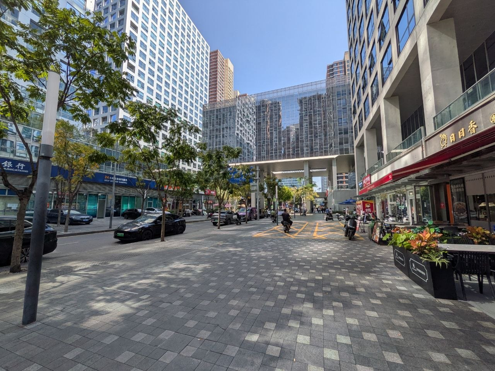
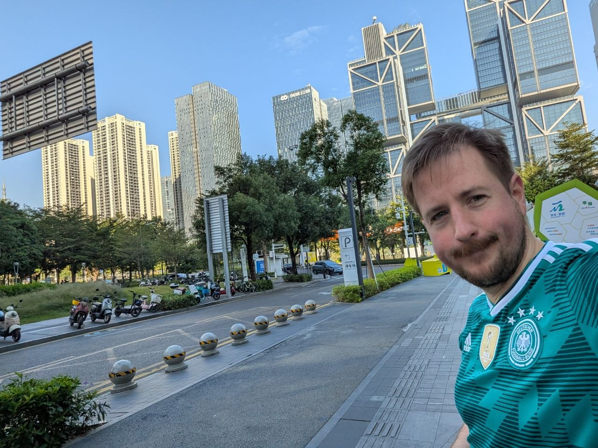

**KiCon Asia 2025** took place in Shenzhen on November 13–15, co-organised by the KiCad project and [Huaqiu PCB](https://www.huaqiu.com). I was there as a speaker — and spent the rest of the time walking around one of the most interesting manufacturing cities in the world.

## The Talk: A Poor Man's Intro to Wire Bonding

My talk was called **"A poor man's intro to wire bonding"** — and that title is exactly right. This wasn't a talk about having the right equipment and a controlled process. It was about what you actually learn when you try to bond real detector chips onto PCBs over two years, with limited resources, and have to figure out most of it by doing.

The chips involved were **CLICpix v3**, **MuPix8**, and **MuPix10** — pixel detector ASICs developed in the context of high-energy physics detector R&D. MuPix8 and MuPix10 belong to the family of **HV-MAPS** (High Voltage Monolithic Active Pixel Sensors): monolithic pixel detectors where the sensor and the readout electronics are fabricated on the same silicon die, with a high bias voltage applied to create a fast depletion zone directly beneath the pixel cell. This combination of thin sensitive volume, fast charge collection, and full CMOS integration makes them attractive for tracking detectors in particle physics experiments, where minimising material budget and withstanding high radiation doses are both critical constraints. The [KIT Application Detector Lab](https://adl.ipe.kit.edu/english/26.php) at IPE Karlsruhe is one of the groups driving MuPix development. These are not hobbyist components. They're small, the pads are tiny, and the bonding tolerances are unforgiving. We used a **Delvotec** wire bonder throughout.

Two years of work compresses surprisingly well. The core of the talk was about the learnings that don't appear in datasheets or application notes: what the bonder parameters actually mean in practice, how pad metallisation affects bond reliability, what a bad bond looks like before it fails, and how you build intuition for a process that is fundamentally tactile.

The laptop slide below shows where the talk lived — somewhere between a particle physics lab and a PCB assembly problem.

## Slides

The slides are available openly. You can view them below or [download the PDF directly](assets/slides.pdf).

<object data="assets/slides.pdf" type="application/pdf" width="100%" height="580" style="border-radius:6px; border:1px solid #1a2a4a;">
  
<a href="assets/slides.pdf">Download the slides as PDF</a>

</object>

## Wire Bonding on Video

If you want to see what the actual bonding process looks like — this is a short clip from the lab, bonding one of the detector chips:

<iframe width="100%" height="400" src="https://www.youtube.com/embed/l0TbzeoqFSs" title="Wire bonding — CLICpix on PCB" frameborder="0" allow="accelerometer; autoplay; clipboard-write; encrypted-media; gyroscope; picture-in-picture" allowfullscreen style="border-radius:6px; margin: 1em 0;"></iframe>

I also gave a version of this talk at **KiCon Europe** earlier in the year. The content overlaps, but the European version goes into more depth on some of the failure modes:

<iframe width="100%" height="400" src="https://www.youtube.com/embed/dNBwY7L6niI" title="Wire bonding — KiCon Europe talk" frameborder="0" allow="accelerometer; autoplay; clipboard-write; encrypted-media; gyroscope; picture-in-picture" allowfullscreen style="border-radius:6px; margin: 1em 0;"></iframe>

## The Conference

KiCon Asia was genuinely different from European conferences — denser, more commercially oriented, with a much higher proportion of hardware people who are adjacent to manufacturing at scale. The Huaqiu co-organisation showed in the programme: several talks touched on the bridge between design and production in ways that feel abstract at European events but are immediate here.

The koala came home with me — not as swag, but as a prize. **Peter Dalmaris** gave a talk titled *"One Tool, One Journey"*, arguing that KiCad should accompany an engineer across their entire career and proposing a "Learner Mode" to ease the entry for beginners. I asked a question that apparently landed well enough to win the raffle prize at the end: an unbranded koala plush sitting on a KiCad × Huaqiu conference folder.

Peter is the author of [**KiCad Like a Pro**](https://www.amazon.com/KiCad-Like-Pro-Peter-Dalmaris/dp/1907920749) (Elektor, multiple editions including a KiCad 9 update), which is the go-to book for anyone wanting a structured path through KiCad beyond the official documentation. He has also written *Raspberry Pi: Full Stack*, *Node-RED and Raspberry Pi Pico W*, and *Maker Education Revolution* — all published through Elektor. If you are learning KiCad seriously, the book is worth having on your desk.

## Shenzhen

It wouldn't be my last time in China — a few months later I was back in [Dongguan for EMC testing](/posts/dongguan-emc-march-2026/). Shenzhen stands on its own regardless: more polished than its neighbour city, more international, the skyline is genuinely impressive at night.

## KiCon Bochum

I'm also involved on the organisational side of KiCon in Germany. Together with [Open Skunkforce e.V.](https://openskunkforce.de), we run **KiCon Bochum** — a local German instance of the KiCon format. If you're in the area and use KiCad, keep an eye on what we announce.

---

*Slides are [openly available](assets/slides.pdf). Video from the bonding lab: [YouTube](https://www.youtube.com/watch?v=l0TbzeoqFSs). KiCon Europe recording: [YouTube](https://www.youtube.com/watch?v=dNBwY7L6niI).*
