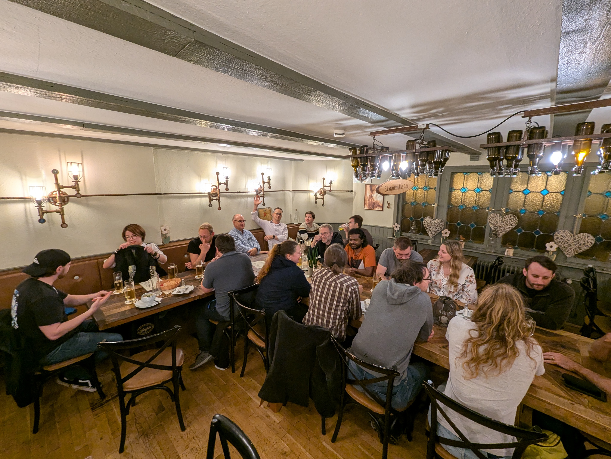
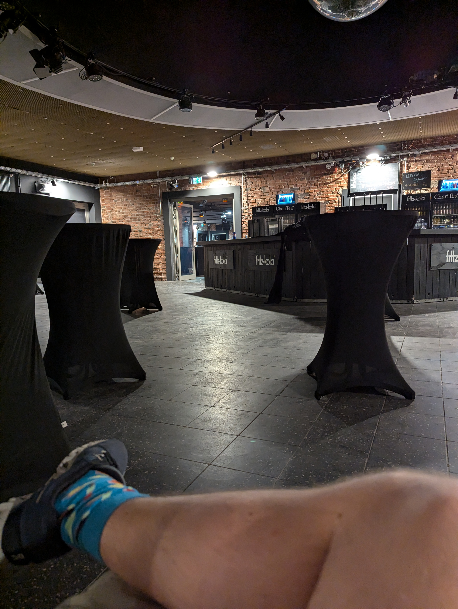

**KiCon Europe 2024** took place on September 19–20 in the [Rotunde Bochum](https://rotunde-bochum.de), organised by [**Open Skunkforce e.V.**](https://skunkforce.org) together with the KiCad project. Around 150 people came — designers, engineers, developers, hobbyists — from across Europe and beyond. It was the largest KiCon we had run in Bochum.

## From KiCon Germany to KiCon Europe

The conference didn't appear out of nowhere. In 2020, I organised the first **KiCon Germany** — a small, informal gathering of KiCad users in Bochum. We ran it four more times, each edition a little bigger, a little more polished. In 2024 we made the leap to a proper European edition: new venue, full two-day programme, workshops, international speakers.

The evening before the conference started with a social dinner. These informal evenings before the programme begins are often where the most useful conversations happen — and this one was no exception.

## The Venue Setup

The Rotunde is a converted industrial building in Bochum-Langendreer. Great atmosphere, brick walls, good acoustics. Getting it ready was a different story.

The setup was a production in itself. Everything that could go wrong did, at least once. Tabea Bökelmann ([@tabeatheunicorn](https://x.com/tabeatheunicorn)) held most of it together — without her, the logistics would have collapsed on day one.

## Wayne, Seth, and What That Meant

For both days, **Wayne Stambaugh** and **Seth Hilbrand** — the two people most responsible for where KiCad is today — were present in Bochum. It was the first time either of them had come here.

I had met Wayne once before, at the original **KiCon 2019 in Chicago**, which was organised by [Chris Gammel](https://contextualelectronics.com) of Contextual Electronics. That was a much smaller event, but it planted the idea that a regular European equivalent was worth building. Five years later, here we were.

## Highlights from the Programme

### Lukas Hartmann — How KiCad Enables the Open Hardware Future

[Lukas Hartmann](https://mntre.com) builds open hardware laptops — the MNT Reform and Pocket Reform are entirely open-source, down to the schematics and PCB files. His talk showed how KiCad is not just a design tool but the foundation that makes open hardware reproducible and auditable by anyone. The "CPU Modules" slide alone — showing actual PCBs of compute modules he designed — made the point better than any abstract argument could.

### Odin Holmes — Edgy

[Odin Holmes](https://x.com/odinthenerd) presented [**Edgy**](https://github.com/skunkforce/edgy_boards/) — a framework for source-controlled, modular PCB reference designs. The core idea: treat PCB subsystems like software libraries, version them properly, compose them. For anyone who has copy-pasted the same power section into the fifth board in a row, the talk hit.

### cpresser — Become a KiCad Librarian

One of the workshops that generated the most discussion was cpresser's session on becoming a KiCad librarian — how the official symbol and footprint libraries are maintained, what the contribution process looks like, and what it actually takes to get a part merged. Practical, hands-on, and overdue: a lot of people use the libraries without knowing how they work or how to improve them.

## The Programme in Full

All talks are recorded and available in the [**KiCon Europe 2024 playlist on YouTube**](https://www.youtube.com/watch?v=T1jR1usucbk&list=PLIXq8kws1BI3Ex13QI9m3bDXm99TjHSLH). A few other sessions worth watching:

- *How to build awesome KiCad plugins* — Joel Schulz-Andres
- *Managing PCB Assembly Variants with KiVar* — Mark Hämmerling
- *CE For makers — Leveraging KiCad* — Clemens Mayer
- *Speed up your Hand Assembly with the Pixel Pump* — Thea (workshop)
- *Clearance and creepage for safety* — Fabien Corona
- *The KiCon Electronic Badge* — Michael MSvB

## What Struck Me

The breadth of the crowd was the thing I hadn't fully anticipated. Hobbyists who build one board a year sat next to engineers running production lines. People came from well outside Germany — some from places where there's no local KiCad community at all. The programme reflected that: there was something for someone picking up KiCad for the first time and something for people filing bug reports against the routing engine.

The KiCad project itself is in a strong place. Having Wayne and Seth in the room for two days, available for questions and conversations in the hallway, made that concrete in a way that watching release videos doesn't.

## Open Skunkforce e.V.

KiCon is one of several conferences [**Open Skunkforce e.V.**](https://skunkforce.org) runs out of Bochum. The others:

- **emBO++** — embedded C++ conference, running since 2016
- **OpenTapeout** — open-source chip design, first edition 2021
- **Practical Datascience Conference (PDSC)** — applied data science for practitioners

The thread connecting all of them is the same: bring people who are actually building things into the same room, keep it affordable, and let the programme be driven by what the community finds worth talking about.

## Sponsors

KiCon Europe 2024 was made possible with support from **AI Gruppe** and **Auto Intern**, among others. Running a 150-person technical conference in a converted industrial venue takes more than goodwill.

---

*All talks: [YouTube playlist](https://www.youtube.com/watch?v=T1jR1usucbk&list=PLIXq8kws1BI3Ex13QI9m3bDXm99TjHSLH). Organised by [Open Skunkforce e.V.](https://skunkforce.org) and the KiCad project.*
