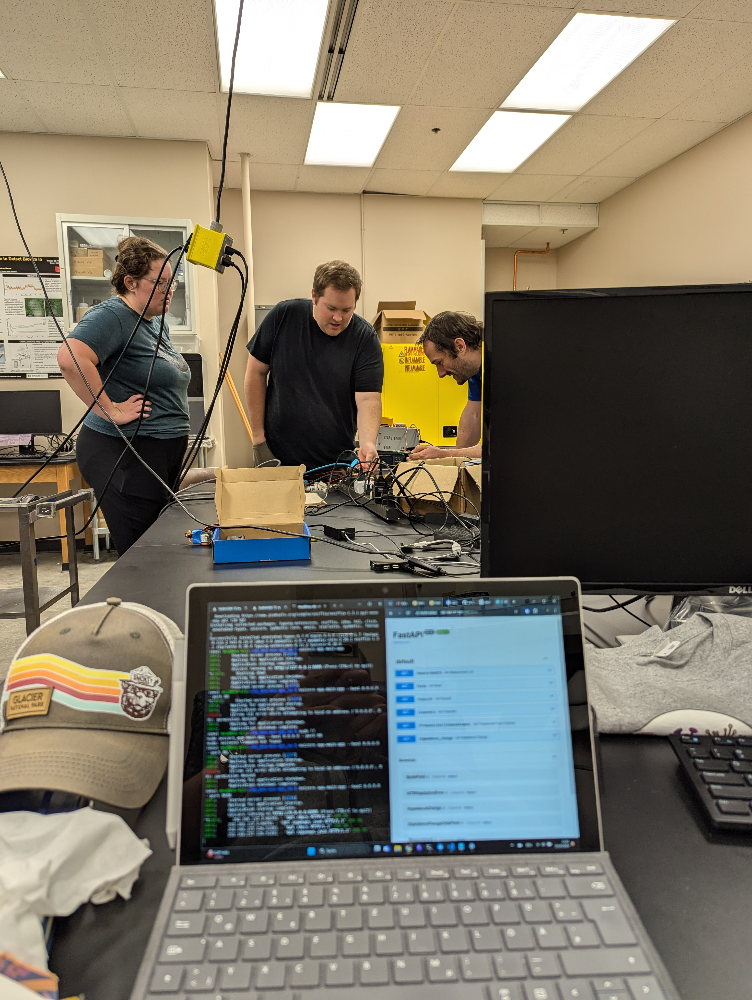
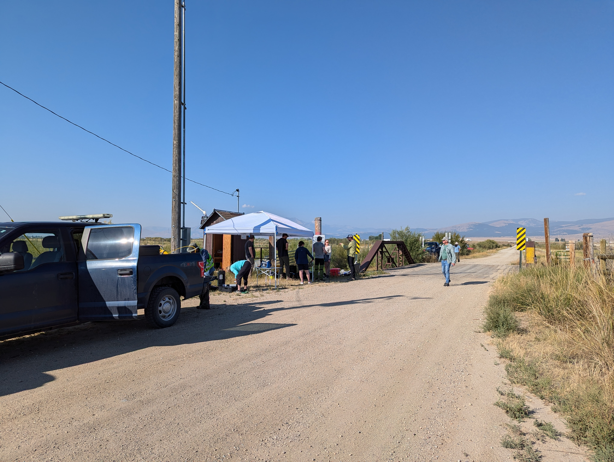
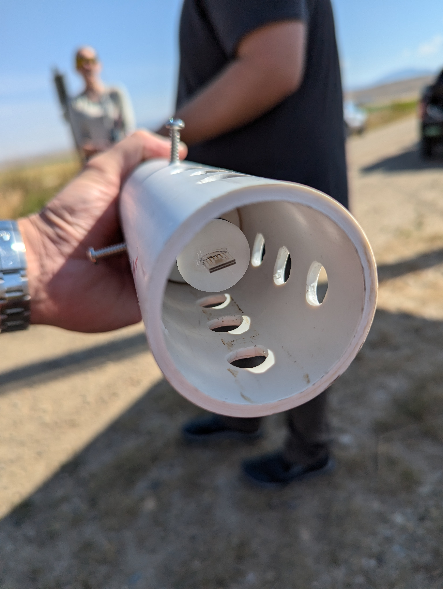
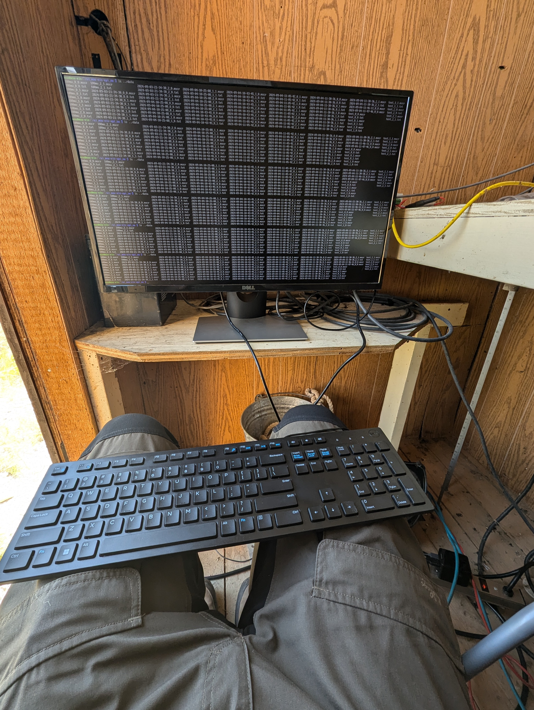

In the summer of 2023, Tabea, Odin Holmes, and I were in Montana for a series of meetings. We had been introduced to the state's network by **Frederick van den Abbeel**, who had arranged conversations with **Scott Osterman** and — unexpectedly — with **Governor Greg Gianforte**. We were even invited to the reception of the Governor's golf cup in Kalispell. None of us had anticipated that a research instrument would come out of any of this.

Those conversations pointed us toward **Montana State University in Bozeman**, and through MSU to **Prof. Stephan Warnat** — an electrical engineer from Schleswig-Holstein who had ended up teaching in Montana, which is not the most obvious career trajectory for someone from the German-Danish borderland. We visited his lab that summer.

## Electrochemical Impedance Spectroscopy

Warnat's work centres on **microfabricated electrochemical sensors** — small chips with precisely patterned electrode arrays that can detect what is growing on their surface. The target: **biofilms**. Specifically, the kind produced by bacteria like *E. coli*, which form dense extracellular matrices that coat surfaces in contact with water. Standard approaches to monitoring these require lab analysis. Warnat's approach was to push the detection into the field, directly into the water.

The method is **Electrochemical Impedance Spectroscopy (EIS)**: apply a small alternating signal across a frequency sweep, measure how the impedance changes, and infer the state of the biofilm from the spectral response. A biofilm changes the dielectric properties of the interface between electrode and water. The change is detectable, quantifiable, and — with the right instrument — automatable.

Warnat walked us through the setup: the ASIC-driven measurement boards, the electrode chips, the cell culture work used to grow controlled biofilm samples for calibration. It was the kind of lab visit where you come in thinking you will stay an hour and leave three hours later.

## Building the Datalogger

The problem with taking EIS into the field is that the instrument that does it in a lab — an impedance analyser — is bulky, mains-powered, and expensive. For continuous monitoring of a river site, you need something that runs on a battery or solar panel, survives temperature swings and humidity, logs reliably over weeks without intervention, and costs less than a car.

Over the following year, we developed exactly that: a portable datalogger with an **integrated spectrum analyser** capable of running EIS autonomously in the field. The hardware design, firmware, and enclosure all went through multiple iterations. Tabea drove much of the practical engineering. The system had to pass data back reliably and handle partial failures without losing the measurement record.

By early September 2024 we were in Bozeman again, this time for the deployment.

## Clark Fork, September 2024

The target site was the **Clark Fork River north of Butte** — a river with a complex history of mining contamination and ongoing remediation work, and therefore exactly the kind of environment where a sensitive biofilm monitoring system is scientifically interesting.

The day before deployment, we were in Prof. Warnat's lab running final checks, calibrating the system, and loading the firmware build we intended to run in the field.

On the morning of September 4th we loaded the gear into a rented Ram Rebel and drove north.

The site was a bridge crossing with a small existing measurement hut — used previously by other monitoring equipment — close enough to the water to run cabling down to the sensor without excessive cable runs. The team from MSU was already there when we arrived. Under a canopy tent that served as a field workshop, we spread out the equipment and started working through the installation checklist.

The sensor housing — a machined PVC tube with the electrode chip mounted inside and flow apertures to let water circulate over the sensing surface — went into the water first.

Getting the cabling from the water up to the measurement hut involved some improvisation. The hut had not been designed with this use case in mind.

The electrode array was positioned against the bridge footing below the waterline, with the cable run secured against the structure.

While one part of the team handled the hardware at the water, the coordination happened under the canopy.

<video src="assets/PXL_20240904_180729502.LS.mp4" autoplay muted loop playsinline style="width:100%;border-radius:4px;margin:1.5rem 0;"></video>

The final step was commissioning the software in the hut itself. The space was not designed for comfort — keyboard on knees, monitor at eye level, no chair. The terminal output scrolling across the screen confirmed what we needed to see: the system was acquiring data and writing it to disk.

The system ran. The first dataset came in clean.

## What the Data Showed

The dataset collected at the Clark Fork made an impression on the funding agencies reviewing the project. The combination of a working outdoor instrument, real river data, and a clear correlation between the EIS signal and known conditions at the site was enough to secure the next phase of the project.

In **November 2025**, Prof. Warnat's postdoc **Michael Neubauer** presented the project's findings at a conference: [*Microfabricated Electrochemical Sensors as a Sentinel System to Detect Biofilms in River Systems*](https://www.researchgate.net/publication/397910043_Microfabricated_Electrochemical_Sensors_as_a_Sentinel_System_to_Detect_Biofilms_in_River_Systems). The work covers the sensor design, the EIS methodology applied to biofilm detection in open-water environments, and the field validation data from the Clark Fork deployment.

---

*The EIS sensor project is a collaboration between [skAInet.io](https://skaiNet.io) and the Warnat Lab at Montana State University, Bozeman.*
