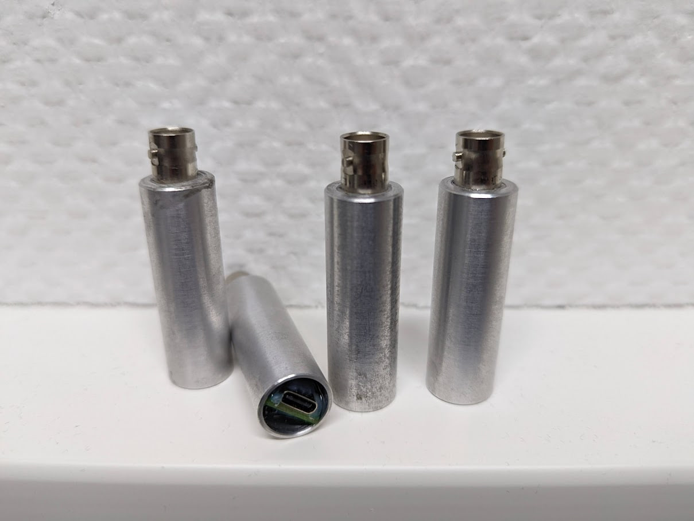
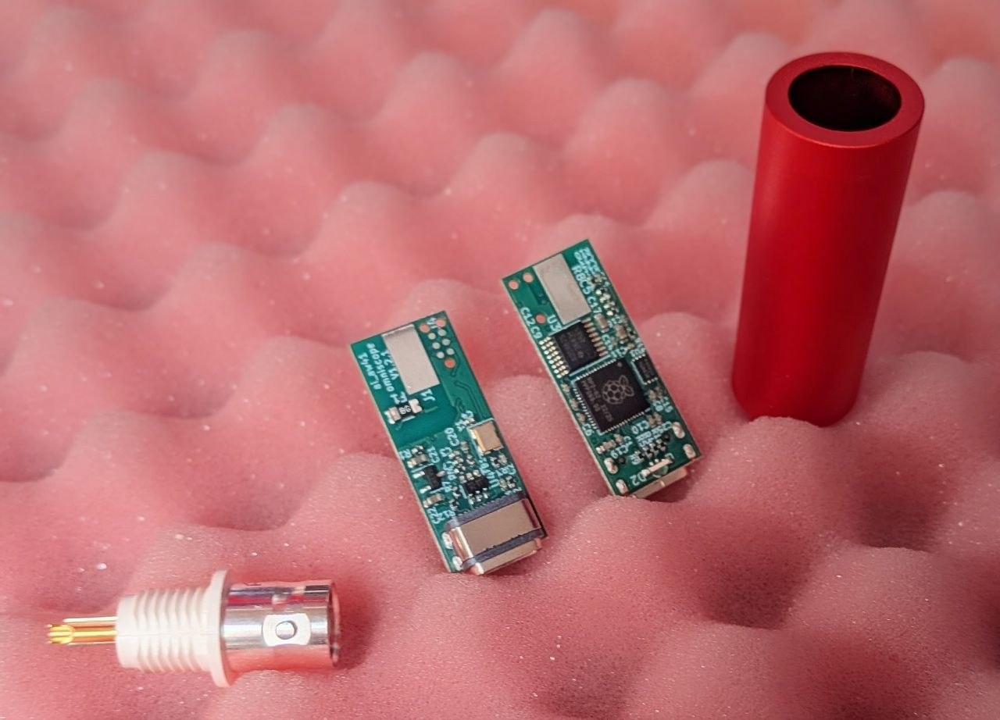
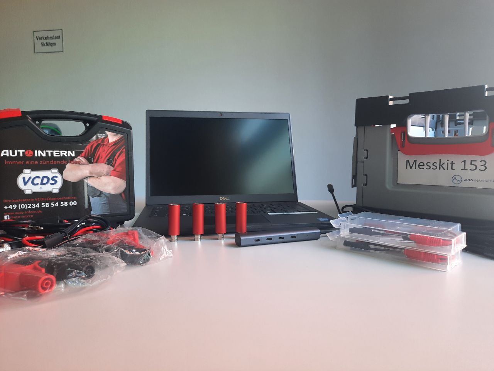
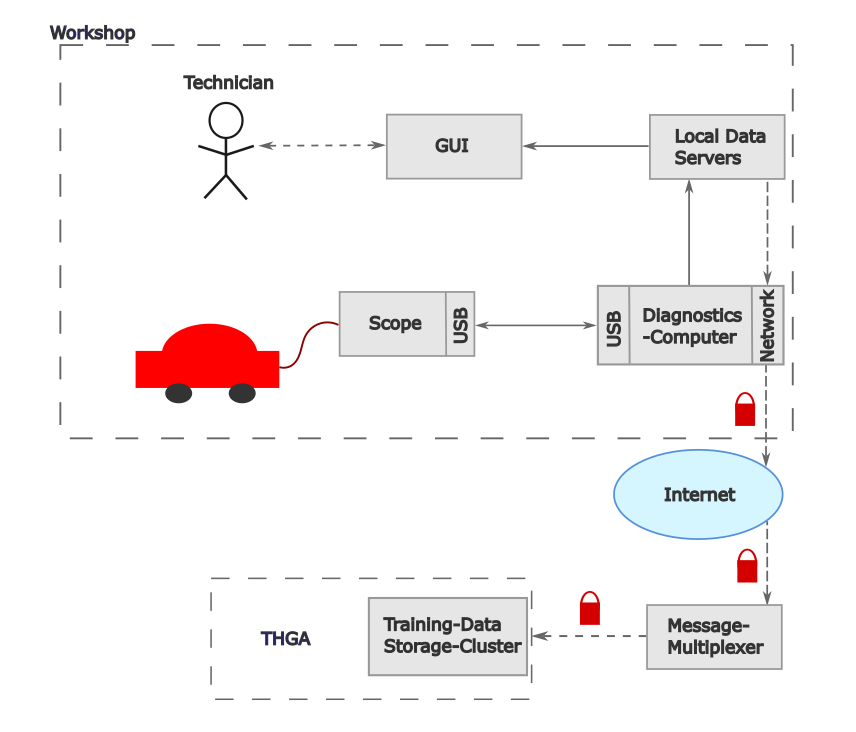

The **OmnAIScope** is a single-channel USB oscilloscope designed for automotive diagnostics. It started as a prototype within the [autowerkstatt4null](https://github.com/nabla-B/paper_aw4null-overview) project — a three-year, federally funded initiative to bring AI-driven diagnostics to independent car workshops. This post covers what it is, how the synchronisation works, and where it's going.

## The Hardware

The current prototype is built around an **RP2040** microcontroller. The specs are deliberately modest:

- **500 kSa/s**, single channel
- **Anodised aluminium housing**, epoxy-sealed after assembly — fully waterproof
- **BNC** on one end, **USB-C** on the other
- No buttons, no screen, no moving parts

That's it. From the outside it looks like a chunky BNC barrel adapter. The simplicity is intentional: the electronics in a car workshop get dropped, kicked, and splashed. Everything that can break has been moved either into firmware or into the server software on the connected computer.

All PCB designs were done in **KiCad**. That workflow held up well throughout the project.

The scope has no revision designation yet — this is still beta hardware. It is, however, already available: [order it directly from Auto-Intern](https://www.auto-intern.de/shop/diagnose-komplettsysteme/281/omnaiscope-tragbares-usb-oszilloskop-fuer-praezise-messungen-beta-version?c=114).

## Multi-Channel Synchronisation Without a Hardware Trigger

Single-channel at 500 kSa/s sounds limiting until you understand the synchronisation approach.

USB generates a **Start-of-Frame (SOF)** packet every millisecond on full-speed connections, timed by the host controller. Every OmnAIScope captures this SOF timestamp alongside its ADC samples and embeds both in the data packet sent to the host. The server on the PC then reconstructs a common time axis across all connected scopes by aligning them on their respective SOF timestamps.

The result: **arbitrary numbers of scopes synchronised to ±half a USB frame** — without a single wire between them, without a hardware trigger line, and without any external clock distribution. For automotive diagnostic use — compression cycles, fuel pump waveforms, CAN signals — this resolution is more than sufficient.

There is a small latency between measurement and display while the server assembles and aligns the packets, but it remains imperceptible in normal use.

## The Server Layer

Each OmnAIScope connects via USB to a host machine running a local server process. That server:

- ingests the raw ADC + SOF data from each connected scope
- performs the SOF-based time alignment
- exposes the synchronised, calibrated waveform data via **REST** and **WebSocket** APIs

This means the frontend — or any other application — doesn't speak directly to the hardware. It speaks to the server. You can build your own tooling, your own analysis pipeline, your own visualisation on top of that API without touching the firmware or the hardware at all.

## Real Measurements

The system has been used for real diagnostic measurements, stored in a CEPH cluster operated jointly with THGA Bochum. Signals captured so far include compression cycles, fuel pre-feed pump waveforms, and common-rail pressure signals. The data has been used to evaluate various classification and analysis approaches. That analysis is out of scope for this post — the point here is that the hardware and server layer work, and the data is useful.

## The Paper

The full context — the automotive diagnostic landscape, the federated architecture, the data flow from scope to AI service to technician UI — is written up in the **autowerkstatt4null overview paper**. It is available on [GitHub](https://github.com/nabla-B/paper_aw4null-overview) and [ResearchGate](https://www.researchgate.net/publication/394930242_autowerkstatt4null_An_Off-Board-Diagnostics_Ecosystem_for_Car-Workshops), and nowhere else. No journal paywall, no publisher fee.

I'm a fan of open access. The paper exists to be read and built upon, not to sit behind a subscription.

**Authors:** Stephan Bökelmann (Ruhr University Bochum), René Glitza (Ruhr University Bochum), Meihui Huang / 黄美慧 (nabla B engineering UG), Odin Holmes (Auto-Intern GmbH), Lukas Jakubczyk (THGA Bochum), Tabea Röthemeyer (Auto-Intern GmbH).

## What's Next

The immediate priority is the **software suite**. A new frontend release is in the works — it's going to be substantially better than what's currently shipping. That said, the server API means you don't have to wait for the official frontend to do useful things with the hardware.

A new hardware iteration will follow once the software is in better shape.

I'm also watching [**@jlcjak**](https://x.com/jlcjak) on X closely — he's working on an oscilloscope project that I'm genuinely excited about, and it deserves attention from anyone interested in this space.

---

*OmnAIScope beta is available at [auto-intern.de](https://www.auto-intern.de/shop/diagnose-komplettsysteme/281/omnaiscope-tragbares-usb-oszilloskop-fuer-praezise-messungen-beta-version?c=114). The paper is at [github.com/nabla-B/paper_aw4null-overview](https://github.com/nabla-B/paper_aw4null-overview).*
