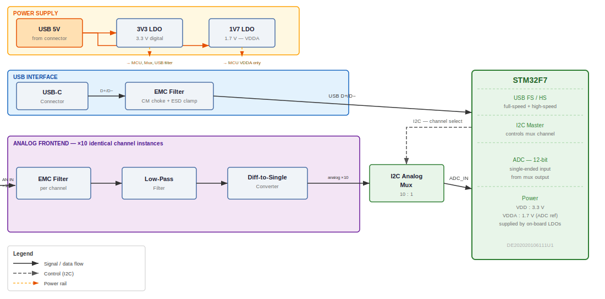

The most expensive mistake you can make in PCB design is building the wrong board. The second most expensive is building a board whose purpose nobody on the team agrees on, because you never wrote it down.

Both mistakes are preventable with the same tool: a plain text file in a version-controlled repository, written before any schematic work begins.

## The Workflow

The process is simple enough to describe in a few steps, but the discipline behind it takes some practice.

**Step 1 — Create a new repository.** A fresh repo on GitHub, cloned locally. This is where the design intent lives, separate from any KiCad project or firmware repo. The design intent should be version controlled on its own terms.

**Step 2 — Write a README.** Not notes. Not bullet points in a chat message. A structured document that explains what the board does, what connects to it, how it gets its power, and what you have not decided yet. More on the structure below.

**Step 3 — Paste the README into an LLM and ask for a block diagram.** The prompt is exactly that simple: paste the whole document, ask for a PlantUML component diagram. The LLM has enough context from the README to produce something architecturally correct in the first pass — not because it knows your project, but because you do, and you wrote it down clearly.

**Step 4 — Commit the `.puml` file.** The diagram source file goes into the repository alongside the README. Not the rendered image — the source. This way, the diagram is editable, diffable, and improvable over time in the same way the README is.

**Step 5 — Render locally with the PlantUML CLI.** A single command:

```bash
plantuml stm32f7-adc-board.puml -tsvg
```

This produces an SVG you can embed in the README, open in a browser, or share with a colleague without them needing any tooling installed. If you want rendering to happen automatically on push, a short GitHub Actions workflow handles it — one YAML file, no external services.

**Step 6 — Iterate.** The LLM gets it mostly right, but not completely right. That is expected and fine. The `.puml` file is a plain text format — editing it manually is quick, and the structure of PlantUML component diagrams is easy to learn in an afternoon. You can also feed the LLM a corrected version and ask it to extend or refine specific sections. Because the whole conversation context is anchored to a written document, the iterations are precise rather than speculative.

## Why This Order Matters

Writing the README first is not about documentation. It is about thinking.

If you will not invest the time to write down what the board should do, you probably will not invest the time to build it correctly either. The act of writing filters out the ideas that sound good in your head but fall apart on paper — which is exactly where you want them to fall apart, before you spend any money.

It also creates something tangible to discuss. Before presenting a schematic to a colleague, a customer, or a review meeting, there is a block diagram that fits on one screen. The diagram does not require electronics expertise to read. It answers the question "what is this thing" in thirty seconds. That is the first thing any technical conversation needs to establish before it can go anywhere useful.

At [Auto-Intern](https://auto-intern.de) and [Open Skunkforce](https://skunkforce.org), we use this process for every board we build. The block diagram is the entry point. The schematic is what follows after everyone agrees on the entry point.

## What the README Should Contain

Seven chapters cover the design intent at the right level of detail for the first-pass diagram:

**1. Purpose** — one paragraph. What problem does this board solve? For whom? In what environment? Everything else in the document flows from this.

**2. External Interfaces** — a table. What physically connects to this board from the outside? USB, CAN, SPI, analog inputs, power connectors. Include the protocol, the connector type, and the direction.

**3. Functional Blocks** — a numbered list of subsystems. Each block gets two or three sentences: what it is, what it does, why it exists. This is the section the LLM turns most directly into diagram nodes.

**4. Power Architecture** — a small ASCII diagram plus a current budget estimate. Where does power come in? What rails does it produce? What does each rail power? A short budget (mA per rail) catches overloaded regulators before any simulation is run.

**5. Signal Chain** — a linear description of how data or signals move through the board from input to output. For a sensor board: physical quantity → conditioning → conversion → processing → output. This section forces you to think about the end-to-end path, not just individual blocks.

**6. Known Constraints** — hard limits. Form factor, cost ceiling, operating temperature, regulatory requirements. These are the things that rule out design choices before the schematic opens.

**7. Open Questions** — a checklist of everything not yet decided. Part selection, firmware protocol, power sequencing, whether an external reference is needed. These become the agenda for the first design review.

## A Worked Example

Here is what this looks like for a real board we built: an STM32F7 with a USB-C interface, an I2C-controlled analog multiplexer switching ten ADC channels, with identical differential frontend electronics on each channel, and a power supply generating 3.3 V and 1.7 V from USB 5 V.

The README for that board is [here](assets/example-board-readme.md). The PlantUML source is [here](assets/stm32f7-adc-board.puml). The rendered block diagram:

<div style="overflow-x:auto; margin: 1.5em 0;">
  
</div>

The diagram shows the complete signal chain: differential analog inputs through an EMC filter, a low-pass filter, and a diff-to-single converter, into a 10:1 analog mux controlled over I2C, and finally into the STM32F7 ADC. USB on the left. Power supply at the top with the two output rails. The STM32F7 on the right with its internal functional sections laid out.

This took two LLM iterations to get right. The first pass placed the mux inside the frontend group, which was structurally wrong — the mux is a separate IC with its own power domain. A one-sentence correction fixed it. The third and later passes were manual edits to the `.puml` file: adjusting labels, correcting the power annotation, adding the internal section dividers to the MCU block.

That is the correct way to think about the LLM's role here: it drafts, you correct. The written document is what makes the correction precise. You are not redescribing the board — you are pointing at a specific node in a diagram whose structure the LLM already understands from your README.

## The PlantUML Source

The full source file is committed to the repository at `assets/stm32f7-adc-board.puml`. A few things worth noting about the structure:

```plantuml
left to right direction

package "Analog Frontend  ×10 identical channel instances" #F3E5F5 {
    component "EMC Filter\n(per channel)"   as CHFILT
    component "Low-Pass\nFilter"            as LPF
    component "Diff-to-Single\nConverter"   as D2S
    CHFILT --> LPF
    LPF    --> D2S
}
```

The `package` keyword creates the group boundary. The `×10` annotation is in the label, not in the component count — PlantUML does not have a repetition primitive, but the label is unambiguous. Dashed arrows for power, solid arrows for signal, the `.[#FFA000].>` syntax for coloured dashed connections. None of this requires reading a manual; it is learnable by example in under an hour.

## Version Control of Design Intent

Once the `.puml` file is committed, a `git diff` on it is meaningful. If the block diagram changes between commits, the diff shows exactly which connections were added, removed, or renamed. That is something a KiCad schematic diff cannot give you at the block level.

Over the course of a project, the README and the diagram evolve together. The open questions get resolved and moved to the relevant functional block. New constraints appear and get documented. The diagram grows detail — individual components appear, bus widths get annotated, power domain boundaries become explicit.

By the time the schematic review happens, everyone has been looking at the same diagram for weeks. The schematic is a confirmation of something already agreed, not a surprise.

---

*The PlantUML CLI is available at [plantuml.com](https://plantuml.com). Rendering in CI requires Java; the Docker image `plantuml/plantuml` avoids a local Java dependency. The example files linked above are free to use as a starting point.*
