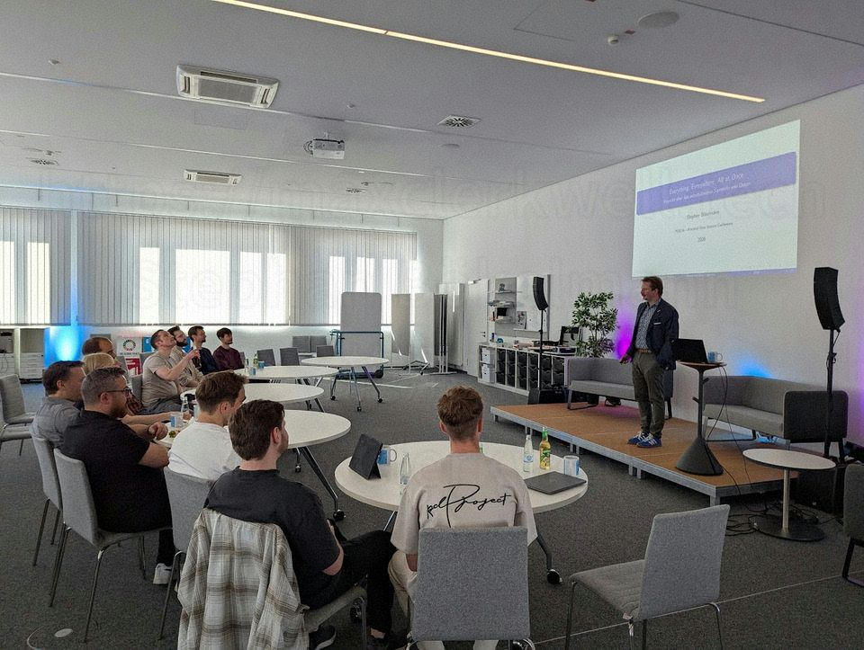
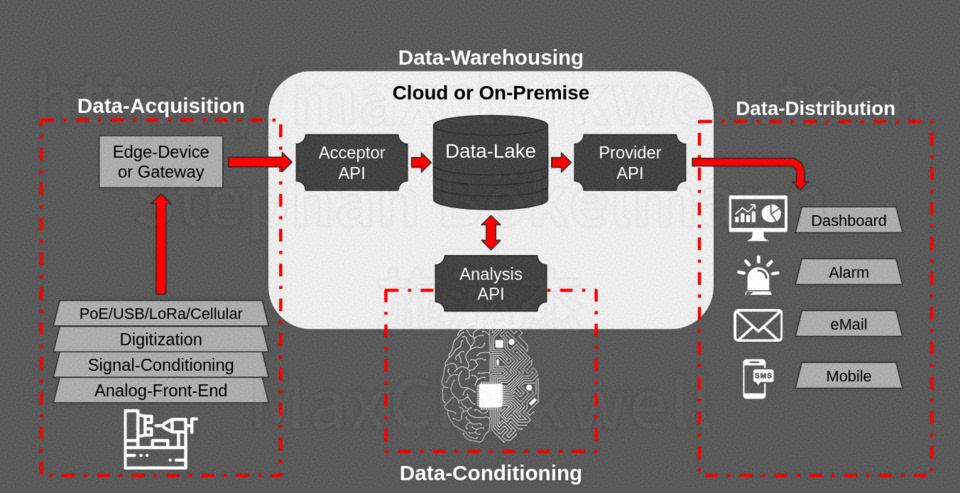
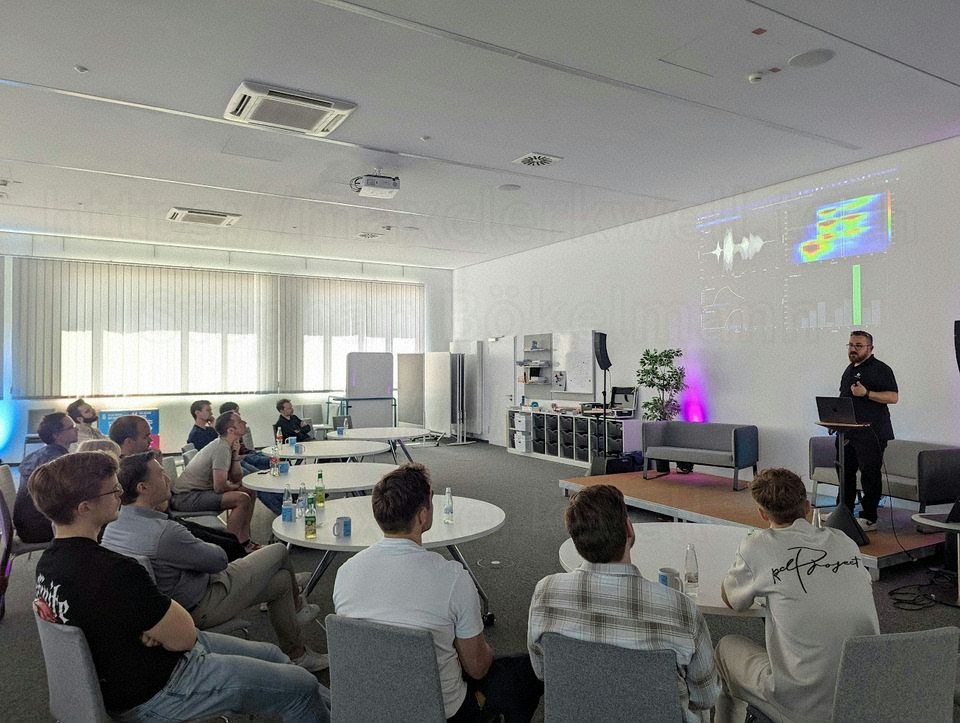
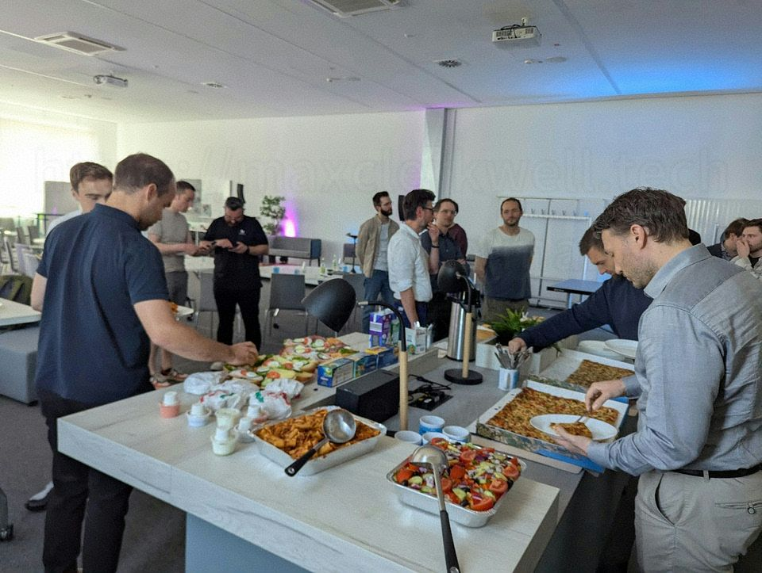
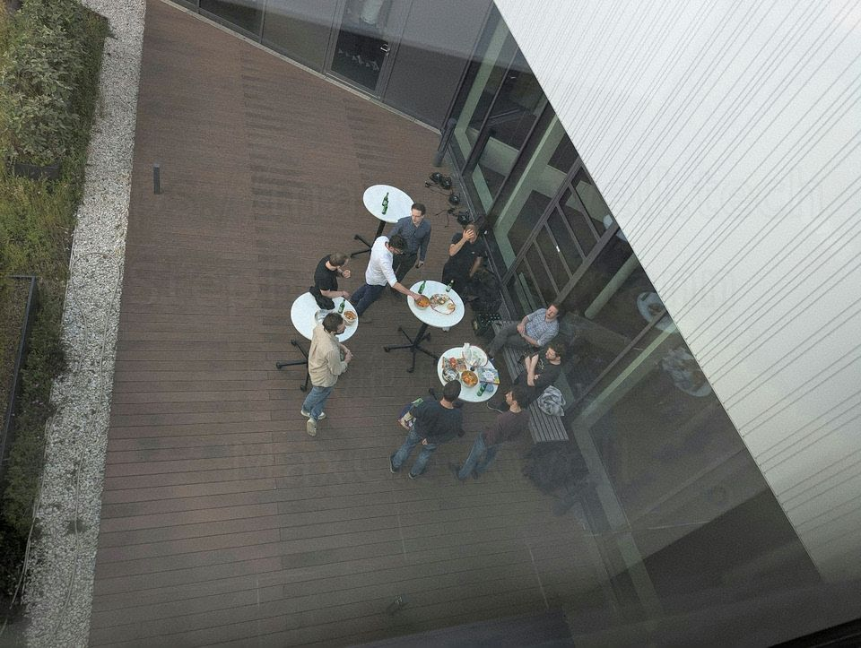

On 22 May 2026 the **Practical Data Science Congress 4000** — PDSC4K for short — took place at the ZESS in Bochum. The goal was explicit: show data science as a practical tool for real problems, not as a buzzword. With roughly twenty participants from industry, research, and academia, the format was kept intentionally small. That constraint created the conditions for something rarer than most conferences manage: actual conversation instead of performance.

I opened the day with the keynote — "Everything, Everywhere, All at Once".

## The Keynote: Everything, Everywhere, All at Once

The talk was built around a simple diagram that splits the data journey into four zones:

Each box represents a responsibility boundary. Most failures in production data systems are not modelling problems. They are ownership problems, or worse, invisible hand-offs between zones where nobody feels responsible.

### Zone 1 — Data Acquisition
This is where the physical world meets software, and where most downstream misery is baked in.

The stack from the bottom up:
- Analog Front-End (amplification, filtering, impedance)
- Signal Conditioning (offset, scaling, protection)
- Digitization (ADC choice, sampling rate, resolution)
- Transport (PoE, USB, LoRa, Cellular)
- Edge device or gateway (first software node)

The hard truth: errors in the lower layers cannot be fixed by later software. A miscalibrated sensor produces plausible but wrong numbers. Aliasing, offset drift with temperature, electromagnetic interference, and insufficient dynamic range all turn into silent data quality problems that models will happily learn from.

The practical takeaway: talk to the hardware people *before* you train anything.

### Zone 2 — Data Warehousing
The Acceptor API is the first real software gate. It should authenticate, validate schemas, enforce rate limits, and — critically — be idempotent. The same logical record arriving twice must not create duplicate rows. Clients should be able to retry aggressively with exponential backoff and jitter; the system must still produce exactly-once semantics on the write side.

Raw data belongs in an immutable append-only lake. Transformed views can live in a warehouse or lakehouse. The lake itself should almost never be mutated after the initial write.

One metric every Acceptor should expose: `last_write_timestamp`. If that value is drifting into the past, you have a silent ingestion failure long before any dashboard turns red.

### Zone 3 — Data Conditioning
This is the zone where data "learns to think" — cleaning, normalisation, feature engineering, model inference. The important architectural point is that conditioning writes back into the lake. Derived features, labels, model outputs, and aggregated views become new first-class datasets.

Quality gates must run before any transformation: schema validation, physical plausibility ranges, timestamp monotonicity checks, completeness against expected record counts, and statistical drift detection. Tools like Great Expectations or Soda Core help, but the mindset matters more than the tool.

Change Data Capture (reading the write-ahead log instead of polling) is dramatically underused in many pipelines. It gives you sub-second latency on actual changes with almost no load on the source system.

### Zone 4 — Data Distribution
The Provider API is the contractual boundary to the outside world. It must be versioned, authenticated, rate-limited, and documented. Most importantly, different consumers have radically different latency and format requirements:

- Dashboards: < 1 s, JSON/REST, polling or WebSocket
- Alarms: < 100 ms, minimal payload, webhook or MQTT
- Email digests: minutes, HTML/text, queued
- Mobile push: < 5 s, platform notification services

A single endpoint for all consumers is an anti-pattern. The latency budgets are incompatible.

Good alarms are rare. Most alarm systems produce fatigue because they lack hysteresis, context, ownership, or a runbook link. A useful alarm says what is happening, since when, with what trend, who is responsible, and where the documented response lives.

### Three sentences to take away

1. **Collecting data is engineering**, not a script that runs somewhere and hopes for the best.
2. **Quality is created at the source** — whatever the analog front-end corrupts, no model will save.
3. **Every box needs an owner** — the largest data pipelines fail on unclear responsibility, not on technology.

The full slide deck (English version of the keynote) is embedded below.

<object data="assets/slides.pdf" type="application/pdf" width="100%" height="580" style="border-radius:6px; border:1px solid #1a2a4a;">
  
<a href="assets/slides.pdf">Download the full keynote slides as PDF</a>

</object>

## The Rest of the Day

Philipp Lehmann followed with a practical report on building a low-budget Ceph cluster. The combination of the morning keynote and his talk made the central tension of many data projects visible: how do you collect data reliably, and how do you store it in a way that remains usable and affordable for years?

Lukas Jakubczyk (PROLAB at [THGA Bochum](https://www.thga.de/)) gave a sharp talk on motor vibration analysis. Lukas and I have built a lot of prototypes and research projects together over the years; his analysis of a real motor-vibration dataset was one of those talks that makes the whole day worth it.

Gert from [point8](https://point-8.de/) presented one of the most grounded industrial examples of the day: AI-supported analysis for recycling construction and demolition waste. The conditions they work under — dust, constantly changing material streams, harsh plant environments, dynamic processes — turn something as seemingly simple as determining particle size distributions into a genuine data science problem, not a clean Kaggle exercise. It was just one of several practical examples [point8](https://point-8.de/) brought to the day.

René presented NexuML, a modular machine learning toolkit designed for repeatability and structure in real development work. He also spoke about the practical use of AI coding agents in day-to-day engineering — what already works, and where clear processes, good engineering discipline, and critical judgment remain non-negotiable.

Enver showed simulation work for analog AI chip use cases. The perspective was valuable: learning-capable sensing at the edge, especially for temporal signals, is becoming realistic. Not everything needs to travel to a large cloud model.

Antonia and Johannes gave one of the most accessible introductions to Fully Homomorphic Encryption I have seen. They deliberately avoided drowning the audience in mathematics and focused on what the technique actually enables for sensitive data workflows. Several people left the session visibly rethinking assumptions about what is and isn't possible with encrypted data.

After lunch we had the panel discussion on AI agents in software development. The question was whether these tools are primarily a productivity boost, a new workflow, or additional overhead. The honest answer that emerged: they can accelerate certain parts of the process and enable new ways of working, but only when tasks are well-scoped, outputs are reviewed, and someone understands when the agent is likely to produce subtle damage rather than progress.

## The Conversations

The talks were good. The conversations between them were better.

In the breaks and the informal hallway track, people kept talking — about the last session, about specific problems in their own projects, about half-baked ideas that suddenly made sense in context, and about private ML side projects. The group was unusually well-composed for that kind of exchange. Several participants later said the same thing: the mix of people made unusually good conversations possible.

Lunch, coffee, and snacks were handled without fuss.

The evening ended on the rooftop with cold drinks, continuing discussions, new contacts, and ideas that will probably surface in next year's talks.

## Why Small Data Science Conferences Deliver More Signal

PDSC4K showed what small, focused technical events can still deliver when they refuse to optimise for scale or spectacle. The combination of practical depth, technical honesty, open discussion, and a deliberately limited headcount produced the outcome almost everyone wants from conferences but rarely gets: people left with concrete thoughts they intend to try, not just another bag of stickers.

Almost all participants said they want to return next year. Several already offered to speak.

The event was organised by **[Open Skunkforce e.V.](https://skunkforce.org/)** (the non-profit behind emBO++, KiCon Europe and the CAD Symposium). René Glitza did most of the heavy lifting this time. PDSC4K is part of the broader Skunkforce conference series; the next one is the **CAD Symposium** in September at PROLAB / [THGA Bochum](https://www.thga.de/) with Prof. Dr. Kortenbruck — modern mechanical CAD with FreeCAD, build123d, 3D scanners and printers. Researchers from institutions such as [DLR](https://www.dlr.de/) regularly take part in the series.

If you want to speak at the next PDSC or just bring someone who should experience this kind of format, drop your name here:

[https://pdsc.skunkforce.org/](https://pdsc.skunkforce.org/) (main site: [skunkforce.org](https://skunkforce.org/))

Small rooms, when they are the right rooms, still beat almost everything else.
