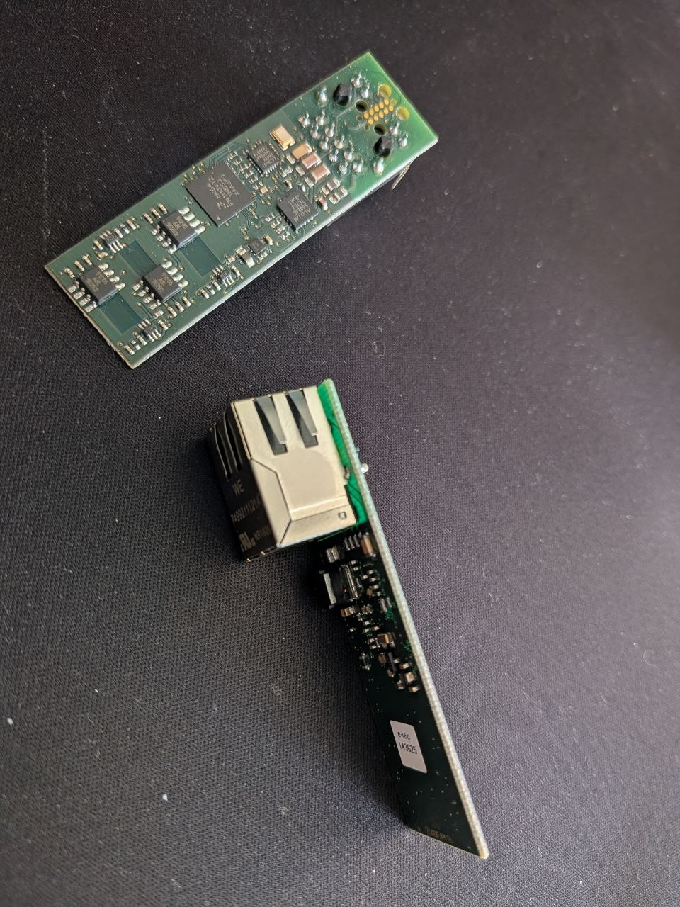
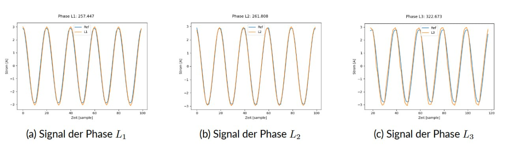
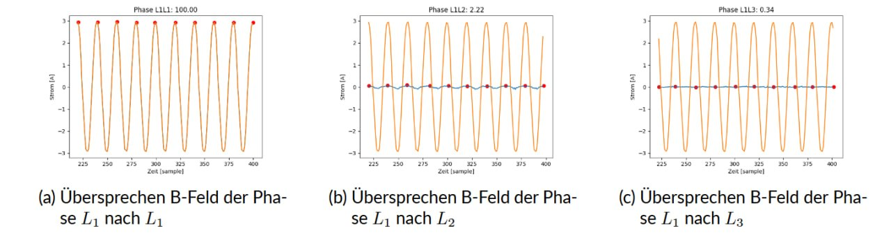
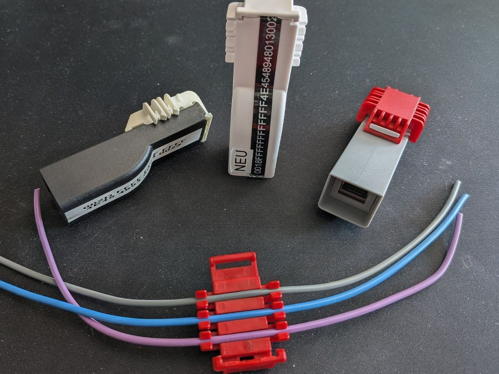
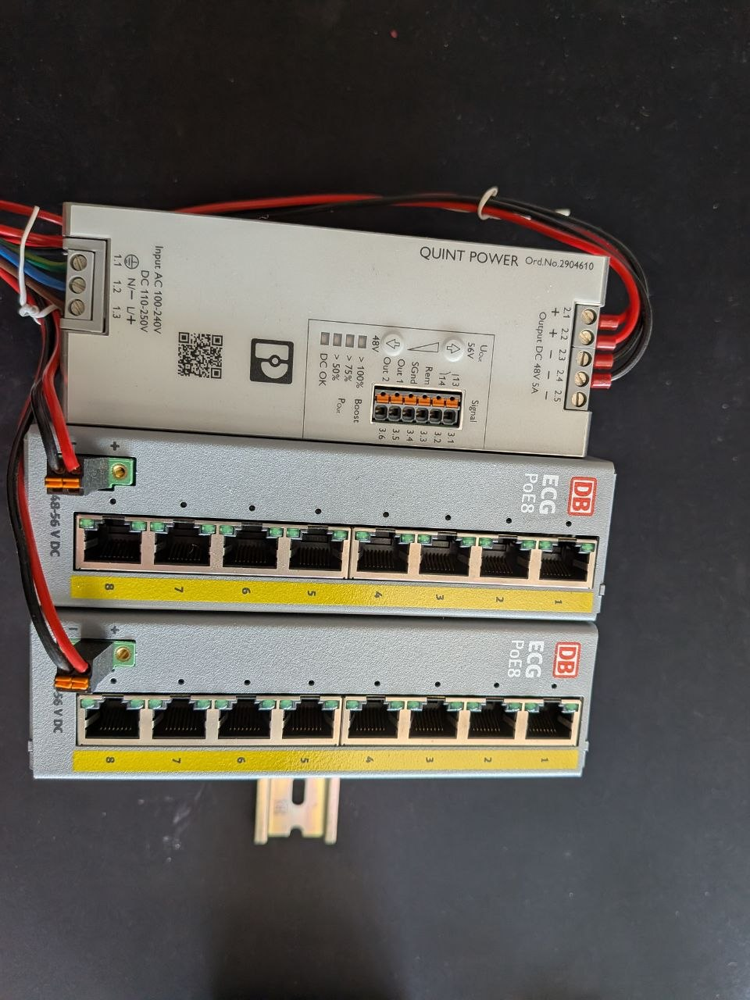
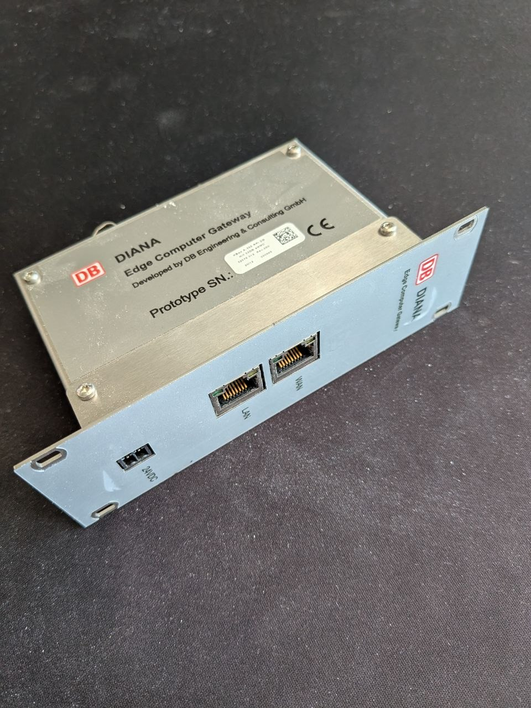

January 2016. A call came in through a mutual contact — [Steffen Scholle](https://eximentor.de/en/home/), at the time an Ex-inspector at DEKRA and today a respected Ex-consultant — connecting us with DB Netz AG. They had a problem: they needed a smarter way to monitor the power supply of their railway switching systems. Three-phase, 16A lines, 1.5mm² cross-section. And they needed it non-intrusively, clip-on, retrofit. No rewiring. No outages. No excuses.

All the pieces already existed internally — E-field sensing, Hall probes, PoE prototypes — and the moment we heard the requirement, we knew exactly what to assemble. January 2016 was the moment it became real. A customer with a real problem, a real network, and real consequences if the measurements were wrong.

Ten years later, that call is still one of the most consequential things that ever happened to this company.

---

## The First Meeting

We met the DB Netz team in Frankfurt. Their initial idea: an RS-485-connected sensor, daisy-chained across the installation. We declined. Not out of arrogance — out of conviction. RS-485 was the wrong answer to the wrong question. You don't build the future of industrial monitoring on a serial bus from 1983.

After several conversations, we landed on Power over Ethernet. PoE. We had already used it in smaller projects, already understood its potential. But this was the first time we had the chance to apply it at scale, in a critical infrastructure context, with a customer willing to push it through qualification together with us.

All the components were there. What could possibly go wrong?

---

## The Four Problems Nobody Warned Us About

Quite a lot, as it turned out. As the requirements crystallized, four challenges emerged that would define the next five years:

1. **Ultra-low power consumption** — under 2W total, including all measurement and communication
2. **Extreme EMC conditions** — railway certification standards, high demands on dielectric strength and touch safety
3. **Ultra-fast installation** — clip-on, no tools beyond what a technician carries, seconds per unit
4. **Non-contact voltage measurement** — no galvanic connection to the conductors

The first three were hard. The fourth was the one that kept us up at night.

---

## The Problem of Voltage Without Contact

Here is something most engineers don't think about carefully enough: **voltage is always a potential difference between two points.** There is no such thing as an absolute voltage. You measure it between two references.

So how do you measure voltage when you have three phase conductors inside an IT network and you are not galvanically connected to any of them?

The short answer: you don't measure voltage directly. You measure the time-varying electric field each conductor produces, capture its influence on an antenna, and reconstruct the voltage waveform from there.

We had built E-field sensing circuits before — that prior work saved us. Our approach: three pairs of flat patch antennas, one pair per phase, placed on the top and bottom surfaces of a thick PCB. The board's normal vector aligned radially to the conductors. Through the 2mm PCB thickness, the electric field decreases with distance as 1/r (long straight conductor approximation), so the two antenna surfaces see slightly different field strengths — and the differential between them scales as 1/r².

That differential — tiny, noisy, deeply buried in interference — is what we amplified with a carefully tuned op-amp circuit and fed into an ADC. Get the gain and filtering right, and you see clean 50Hz sinusoidal waveforms from three conductors that you have never electrically touched.

To recover absolute voltage values, we added a single galvanically connected voltage reference measurement per switching station — one point in the network where we knew the actual supply voltage. That scalar reference, combined with our normalized E-field measurements, gave us calibrated voltage readings across the entire installation.

The current measurements, by comparison, were trivial. Hall sensors, standard technique. Or so we thought — until the housing changed everything.

---

## The Housing Problem

On the bare PCB, everything worked. Beautiful signals, clean data, happy engineers.

Then we put it in a housing.

Together with [Christian Czayka](https://www.linkedin.com/in/christian-czayka-7769751ab/), we developed three different enclosure concepts in 3D CAD, printed the first variants, and assembled prototypes: elegant, compact, tool-free installation. The kind of device you look at and immediately understand how to fit it.

But when the PCB moved inside the housing and the conductors moved further from the antennas, the E-field signals weakened. For voltage sensing, we compensated with higher gain and a tighter frequency filter — manageable.

For current, the situation was different. We needed to see harmonics — the full spectral content of the current waveform, not just the fundamental. Brute-force amplification destroys that. Filtering kills it. We needed a different approach.

The solution: **B-field collecting ferrite cores embedded directly into the clamping clips** that hold the conductors. The geometry was non-trivial. Getting the ferrite dimensions, permeability, and positioning right required weeks of field calculations and FEM simulations — work that fell to [Tabea Bökelmann](https://www.linkedin.com/in/tabea-b%C3%B6kelmann-0b9794198/), who I had met during our physics studies and who is, without qualification, significantly better at mathematics than I am.

The ferrites were custom-manufactured for us, embedded into the prototype clips, and the signals came back. Clean harmonics. Full spectral resolution. A device that worked not just in the lab, but as an actual product that could be assembled by a technician in the field.

---

## Young, Naive, and Almost There

At this point — roughly two years in — we genuinely believed we were almost done. The physics worked. The electronics worked. The housing looked right. We had a team that knew what it was doing.

We were in our early-to-mid twenties, which explains a lot. Odin was already thirty, which in Oregon hippie years is basically a senior engineer — though it did not appear to grant him any additional realism about the timeline either.

What followed was two more years of EMC certification at CETECOM, transitioning the housing from 3D-printed prototypes to injection-molded production parts together with LB Kunststoff, and the full qualification cycle under railway standards. Dielectric strength. Touch safety. Vibration. Temperature cycling. The kind of testing that finds every corner you cut and every assumption you made.

We finished. It took longer than we planned. It always does.

---

## What This Project Taught Us

Looking back now, a decade later, the skAInet-PowerSense was not just a product. It was an education.

**PoE first.** Always. If you commit to PoE, you get TCP/IP, power, and a standards-compliant physical layer in a single cable. Everything the network has to offer becomes accessible to your device. We have not seriously considered an alternative since 2016.

**Digitize as close as possible to the source.** The moment you convert a physical signal to bits, you can apply error correction, checksums, timestamps, and all the reliability mechanisms that decades of networking research have produced. Analog signals degrade. Digital packets either arrive or they don't.

**A working PCB is not a finished product.** This is perhaps the hardest lesson for hardware engineers to internalize. The electronics are phase one. What follows is a product development process that is at least as demanding. Today, we structure our projects accordingly:

- **PoC (3–6 months):** Looks nothing like the product. Integrates all the physical measurement principles. Validates that the science works.
- **Prototype (6–9 months):** Looks like the product. Manufactured by hand. Proves the form factor and installation concept.
- **Prototype of Product (~12 months):** Manufactured using the same processes as eventual series production. The first object you can genuinely call a device.

We estimate wrong every time. We estimate less wrong than we used to.

---

The skAInet-PowerSense is still in service across DB Netz switching stations. It monitors power supply quality in infrastructure that moves millions of people every day, without anyone on the platform knowing it exists.

That is what good monitoring looks like.

---

## There Is More

This post barely scratches the surface. What I have not covered: inter-channel crosstalk and how we characterized and compensated it, PoE shutdowns caused by drawing too little current (yes, that is a real problem — the standard assumes you need power, not that you are carefully conserving it), the sensitivity of every measurement to the exact relative positioning of conductors and PCB, and the full calibration workflow that ties all of it together into a number you can trust.

Every one of those deserves its own post. Maybe one day.

If any of this is relevant to something you are building — or if you just want to go deep on non-contact sensing, EMC in rail environments, or PoE power budgeting — come find me on Discord. I enjoy talking about this stuff more than I probably should.

<a href="https://discord.gg/2BXuUY6hrX" class="link-card-discord" target="_blank" rel="noopener noreferrer">
  <i class="fab fa-discord"></i>
  

    Discord — Full Stack Engineering
    Direct access to me and my colleagues. Webinars, live Q&amp;A, and community discussions for engineers across the full stack.
    Join the server →
  

</a>
