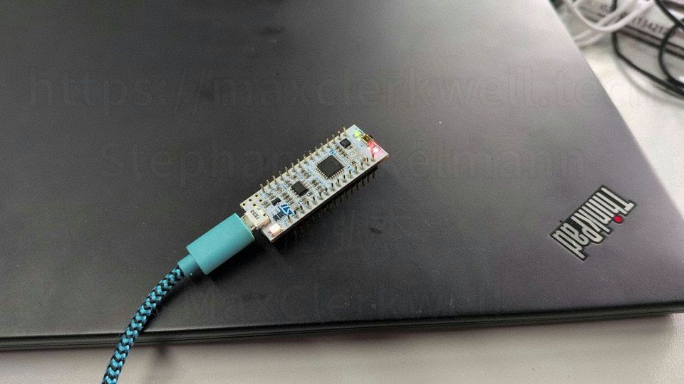
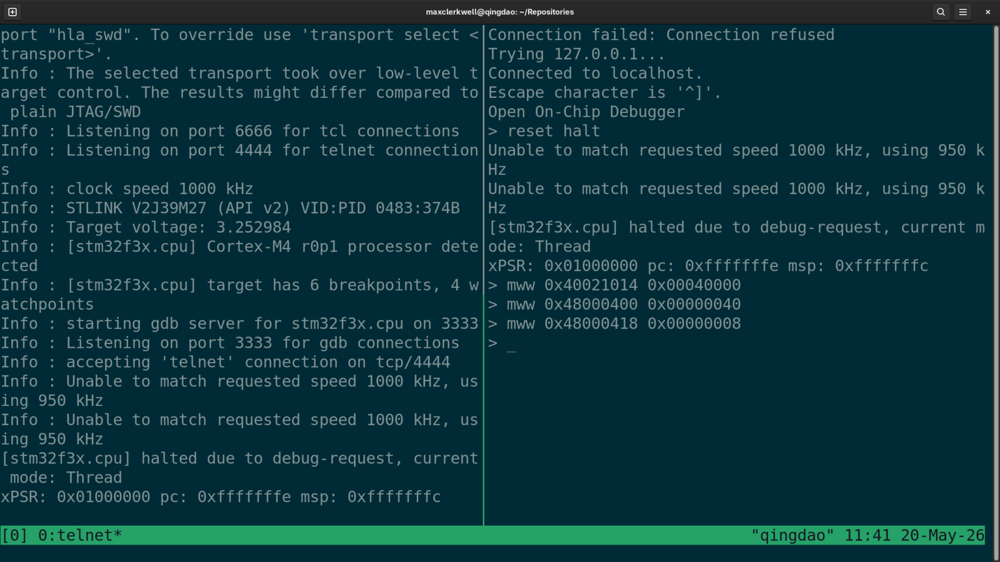

Most embedded tutorials start the same way: install the toolchain, write a `main.c`, fight the linker script, flash the binary, and then — finally — a LED blinks. That is a perfectly valid path. But there is a shorter one, and it teaches you something the longer path tends to skip: registers are just memory. You can read and write them directly, from your laptop, without compiling anything.

This post shows how to do exactly that on an [**STM32F303K8 Nucleo-32**](https://www.mouser.de/ProductDetail/STMicroelectronics/NUCLEO-F303K8?qs=kWQV1gtkNndPxYr6NNfTBw%3D%3D) using **OpenOCD** and a plain **telnet** session.



---

## What Is SWD? Serial Wire Debug Explained

**Serial Wire Debug** (SWD) is a two-wire protocol — `SWDIO` (data) and `SWDCLK` (clock) — defined by ARM for Cortex-M processors. It gives a debug host on your PC read and write access to the entire address space of the microcontroller: Flash, RAM, and every peripheral register.

The ST-Link circuit on the Nucleo board is a USB-to-SWD bridge. When you plug the board into USB your Linux machine sees it as a USB device; OpenOCD speaks to the ST-Link firmware over USB and speaks SWD to the F303 over the two-wire bus.

```
PC (Linux)
  └── USB ──► ST-Link (onboard)
                └── SWD ──► STM32F303K8
```

No UART, no bootloader mode, no jumpers to move. The same connection you use to flash firmware is the connection we use here to poke registers live.

---

## Install OpenOCD

On Ubuntu or Debian:

```bash
sudo apt update
sudo apt install openocd
```

Verify the installation:

```bash
openocd --version
# Open On-Chip Debugger 0.11.0 (or newer)
```

### udev rules — allow non-root access to the ST-Link

By default, USB devices are owned by root. Without a udev rule you would have to run OpenOCD as root every time. The OpenOCD package ships rules; you just need to activate them:

```bash
sudo cp /usr/share/openocd/contrib/60-openocd.rules /etc/udev/rules.d/
sudo udevadm control --reload-rules
sudo udevadm trigger
```

Unplug the Nucleo and plug it back in. Now your user account can access the ST-Link without `sudo`.

---

## Start OpenOCD

OpenOCD needs to know two things: which debugger interface to use, and which target chip it is talking to. Both are expressed with `-f` flags pointing to configuration files that ship with OpenOCD:

```bash
openocd -f interface/stlink.cfg -f target/stm32f3x.cfg
```

You should see output like:

```
Info : STLINK V2J37M26 (API v2) VID:PID 0483:374B
Info : Target voltage: 3.259741
Info : stm32f3x.cpu: hardware has 6 breakpoints, 4 watchpoints
Info : Listening on port 4444 for telnet connections
```

OpenOCD is now running in the foreground and listening on three ports:

| Port | Purpose                  |
|------|--------------------------|
| 4444 | Telnet / TCL REPL        |
| 3333 | GDB server               |
| 6666 | TCL RPC                  |

Leave that terminal open and open a second one.

---

## Connect via telnet

```bash
telnet localhost 4444
```

You land in an interactive TCL REPL. The two commands you will use most:

| Command            | Effect                                    |
|--------------------|-------------------------------------------|
| `mdw <addr>`       | **M**emory **d**isplay **w**ord — read a 32-bit register |
| `mww <addr> <val>` | **M**emory **w**rite **w**ord — write a 32-bit value     |
| `reset halt`       | Reset the CPU and immediately freeze it   |
| `resume`           | Let the CPU run again                     |

That is the whole interface. Two commands to read and write. The rest is knowing which addresses to use.

---

## Finding addresses in RM0316

The reference manual for the STM32F303 family is **RM0316**. It is free to download from st.com and contains every register, every bit field, and every base address. The datasheet tells you what the chip can do; the reference manual tells you how to make it do it.

Two-step process every time:

1. **Memory Map** (chapter "Memory and bus architecture") — gives you the **peripheral base address**.
2. **Register Map** at the end of each peripheral chapter — gives you the **register offset**.

`effective address = base address + offset`

### RCC — enable the GPIOB clock

Peripherals on an STM32 do not respond to register writes until their clock is enabled. GPIOB is on the AHB bus, so we need **RCC_AHBENR** (AHB peripheral clock enable register).

From RM0316:
- RCC base address: `0x40021000`
- `AHBENR` offset: `0x014`
- → `RCC_AHBENR` lives at `0x40021014`

Open the `AHBENR` register description. Bit 18 is called `IOPBEN` — IO port B clock enable. We need to set that bit.

Read the current value first:

```tcl
mdw 0x40021014
# 0x40021014: 00000000
```

Set bit 18 (`0x00040000`):

```tcl
mww 0x40021014 0x00040000
```

GPIOB is now clocked.

### GPIOB_MODER — configure PB3 as output

Every GPIO pin has two mode bits in `MODER`. The encoding:

| Bits | Mode       |
|------|------------|
| 00   | Input      |
| 01   | Output     |
| 10   | Alternate function |
| 11   | Analog     |

Pin 3 occupies bits 7:6. We want `01` there, everything else at reset default (input, `00`).

From RM0316:
- GPIOB base address: `0x48000400`
- `MODER` offset: `0x000`
- → `GPIOB_MODER` at `0x48000400`

Bit 7 = MODER3[1], bit 6 = MODER3[0]. We want bit 6 = 1, bit 7 = 0.

`0x00001000` in binary: bit 12. Wait — that is pin 6. Let us count carefully.

Pin N → bits (2N+1):(2N). For pin 3: bits 7:6. Bit 6 = `1 << 6` = `0x00000040`.

```tcl
mww 0x48000400 0x00000040
```

PB3 is now configured as a push-pull output.

### GPIOB_BSRR — set and reset the pin atomically

`BSRR` (Bit Set/Reset Register) is a write-only register that lets you set or clear output pins without a read-modify-write cycle. It is 32 bits wide:

- **Lower 16 bits** (bits 15:0): writing a `1` to bit N **sets** pin N high.
- **Upper 16 bits** (bits 31:16): writing a `1` to bit (N+16) **resets** (clears) pin N.

From RM0316:
- `BSRR` offset: `0x018`
- → `GPIOB_BSRR` at `0x48000418`

Set PB3 (LED on):

```tcl
mww 0x48000418 0x00000008
```

`0x00000008` = bit 3 in the lower half → set pin 3.

Reset PB3 (LED off):

```tcl
mww 0x48000418 0x00080000
```

`0x00080000` = bit 19 = bit (3+16) in the upper half → reset pin 3.

---

## The complete sequence in the telnet session

```tcl
reset halt
mww 0x40021014 0x00040000
mww 0x48000400 0x00000040
mww 0x48000418 0x00000008
mww 0x48000418 0x00080000
```

Type those five lines one by one and watch LD3 respond.

---

## Blinky — a small TCL loop

The telnet interface is a full TCL interpreter. `after N` pauses for N milliseconds. `proc` defines a procedure:

```tcl
reset halt
mww 0x40021014 0x00040000
mww 0x48000400 0x00000040

proc blink {n} {
    for {set i 0} {$i < $n} {incr i} {
        mww 0x48000418 0x00000008
        after 500
        mww 0x48000418 0x00080000
        after 500
    }
}

blink 10
```

LD3 blinks ten times with a 500 ms period. No compiler, no linker, no flashing.



---

## What Just Happened: SWD, Memory Mapping, and GPIO

The CPU was halted with `reset halt`. It executed zero instructions of firmware during the whole demo. Everything we did was OpenOCD writing directly to peripheral registers over SWD. The ST-Link bridge carried the writes from your terminal into the silicon.

This is the insight worth taking away: **peripheral registers are memory**. The GPIO, the RCC, the UART, the timers — they are all just addresses in the 32-bit address space. The CPU writes to them to configure hardware. You can write to them too, from outside the chip, using the debug interface that ARM put there precisely for this purpose.

Once you understand that, you understand what every line of your future bare-metal C code is actually doing.

---

## Next steps

- Add a `USART` and send bytes the same way — no firmware needed.
- Read `GPIOB_IDR` (`0x48000414`) while pressing a button to watch the bit flip.
- Write a TCL script and pipe it via `netcat` for non-interactive board tests.
- When you are ready: write the same register sequence in C and flash it as a proper binary.

The reference manual is not a wall of intimidating text. It is a lookup table. You already know how to read it.
