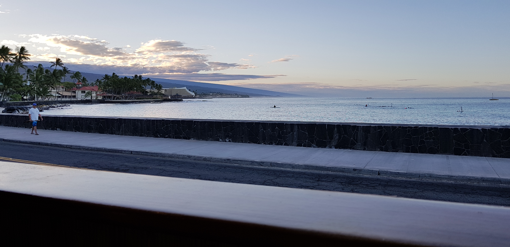
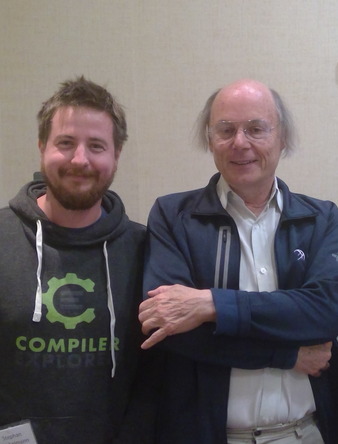
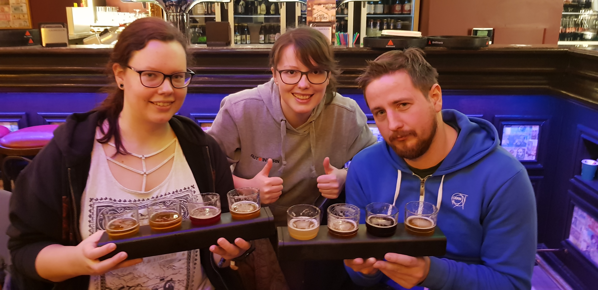
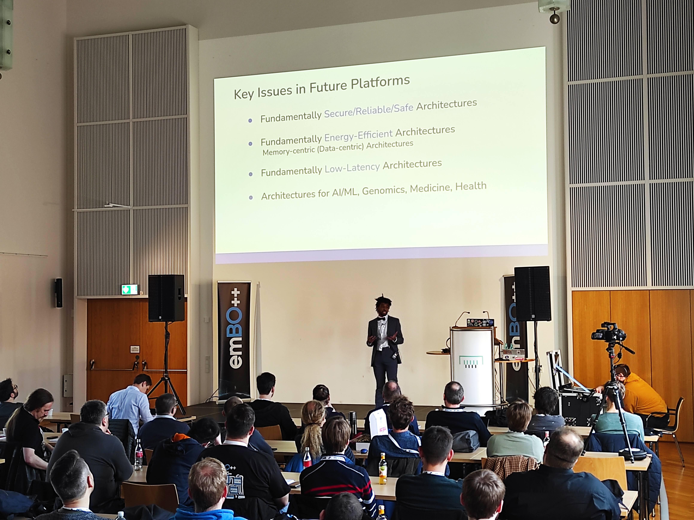
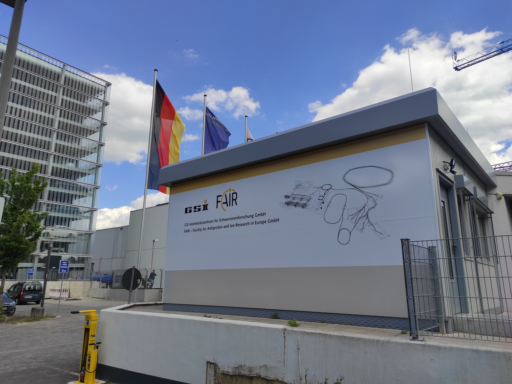
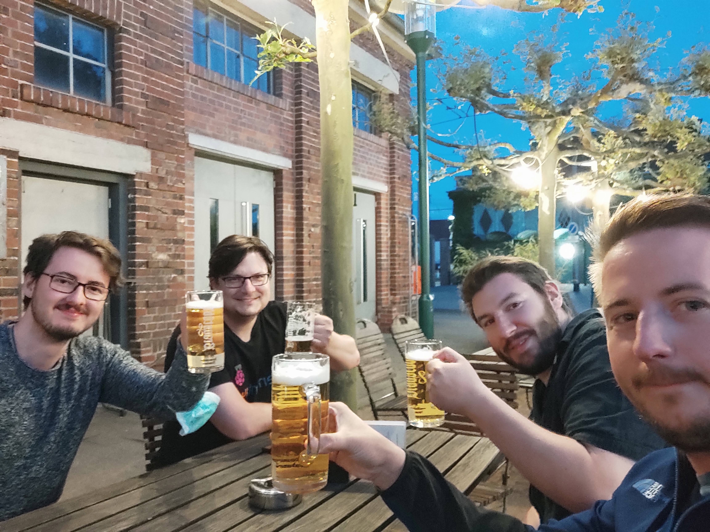

In 2015 I went to my first real conference. I came back a different engineer. That sounds dramatic, but it's accurate, and it took me a while to understand why. This post is an attempt to write that down — both for myself, after ten years, and for the companies, universities, and open-source projects that keep asking us at [Open Skunkforce e.V.](https://skunkforce.org) how we think about this.

## Meeting C++, 2015

I went to **Meeting C++ 2015** with my colleague [Odin Holmes](https://x.com/odinthenerd). At that point I thought I was a reasonably competent programmer. I was wrong — not in the way that's demoralising, but in the way that only becomes visible when you're suddenly in a room full of people who have been thinking deeply about problems you haven't encountered yet.

I didn't know what I didn't know. I heard talks on topics I had no idea existed. I had conversations in corridors that reframed things I thought I understood. Some of those conversations turned into projects. Some turned into friendships that are still going today.

That's the thing about conferences that doesn't translate into any other format: you cannot Google your way to the questions you haven't thought to ask yet. A talk puts an idea in front of you. A conversation in the hallway afterwards tells you what that idea means in your situation. You go home with a list of things to learn that you didn't know you needed to learn.

## The List

Over the past ten years, roughly:

**As attendee or speaker:**
- Meeting C++ — 2015, the beginning
- code:dive, Wrocław — many years in a row
- FOSDEM, Brussels — regularly for eight years
- KiCon US, Chicago 2019 — organised by [Chris Gammel](https://contextualelectronics.com)
- ISO C++ Committee Meeting, Kona 2019
- ISO C++ Committee Meeting, Prague 2020
- PANDA and GSI collaboration meetings — multiple
- NVIDIA C++ Meetup, Silicon Valley
- KiCon Asia 2025, Shenzhen — as speaker
- Various smaller conferences and user groups in Germany and the Netherlands

**As organiser (with [Open Skunkforce e.V.](https://skunkforce.org)):**
- **emBO++** — embedded C++ conference, Bochum, every year since 2015
- **OpenTapeout** — open-source chip design, first edition 2021
- **Practical Datascience Conference (PDSC)**
- **KiCon Germany** — four editions from 2020
- **KiCon Europe 2024** — Rotunde Bochum, 150 attendees
- **CPPP, Paris** — marketing and video production, on invitation from Fred Tingaud

That is a lot of rooms. A lot of evenings. A lot of hallways.

## The Moments That Stay

Three moments from the past decade stand out when I try to articulate what conferences are actually for.

**Kona, 2019.** I was at the ISO C++ Committee meeting — not as a voting member (I don't hold a DIN seat, so I could participate actively in discussions but not vote), but as a working participant. The Pacific coast outside the venue looked like this every morning:

One evening I found myself at dinner with **Bjarne Stroustrup** and **Herb Sutter**. The conversation was direct, curious, practical. The kind of exchange that only happens when everyone at the table has decided to take the time seriously.

**Wrocław, code:dive.** [Shawn Parent](https://twitter.com/shawnpresent) and [Bartosz Milewski](https://twitter.com/BartoszMilewski) ended up with Odin, Tabea, and me in a bar until well past any sensible hour. The conversation went everywhere — category theory, compiler internals, what it means to write software that is honest about what it does. I've learned more in evenings like that than in entire conference days.

**Silicon Valley.** Tabea and I were at an NVIDIA C++ meetup when **Barbara Gellar** and **Ansel Sermersheim** — authors of the [CopperSpice](https://www.copperspice.com) GUI framework — walked up and asked if we were the people who organised emBO++. That conversation turned into an invitation to stay at their home for four days. We spent those days talking about C++, software design, and what it means to build tools that last. We're still in regular contact today.

None of these moments were scheduled. None of them appear on any programme. They happened because people who care about the same things ended up in the same place, with time to talk.

## emBO++: Eleven Years

The arc of emBO++ is the clearest illustration I have of how this compounds over time.

The first edition, 2015: four people in a room. The second: speakers from Russia to San Francisco, 40 attendees. It felt unreasonably large at the time. By 2020 we had **250 people in Bochum** — the last edition before COVID.

Going online during the pandemic worked, technically. But something was missing. The talks were fine. The questions-and-answers were fine. What you cannot replicate over video is the moment after the talk ends, when someone turns to the person next to them and says *"did you notice that detail he mentioned in passing?"* — and that becomes a two-hour conversation over dinner.

Conferences have not fully recovered since COVID. That's the honest picture. Attendance is lower than it was. The habit broke. This bothers me most when I think about students and people early in their careers — the ones who would benefit most from being in a room where the level is higher than anything they've encountered before.

## The Broader World

Conferences are not only about software. Some of the most formative meetings I've attended were **PANDA and GSI collaboration meetings** at [GSI Helmholtzzentrum für Schwerionenforschung](https://www.gsi.de) in Darmstadt — particle physics, large-scale detector hardware, international teams building instruments that take decades to complete.

The dynamics are different from a software conference, but the core is the same: the real work happens in the corridors, at the dinner table, in the conversations that drift far from the official agenda.

At **KiCon Europe 2024** in Bochum, the same pattern held. 150 people, two days, the Rotunde. Lukas Hartmann's talk on open hardware CPU modules set off conversations that continued well past the venue closing.

Open Skunkforce also runs smaller, focused events throughout the year — user groups, workshops, single-topic evenings — where the same principles apply at a smaller scale.

## What a Good Conference Actually Is

Here is what we have learned from organising events for a decade:

**Talks set the agenda. Conversations are the output.** A good talk gives the audience something to argue about. The argument happens in the hallway, at dinner, at the bar. If people leave immediately after the last session, the conference has half-succeeded.

**The pre-event evening is not optional.** Every conference we run includes a social the evening before the programme starts. People arrive, meet each other without the structure of sessions, and come to day one already knowing who they want to talk to.

**Dinner outside the venue belongs in the programme.** Not a sponsored cocktail reception in the conference hall. A table at a restaurant, with speakers and attendees mixed. The conversations that happen there are the ones people mention years later.

**100–200 people is the sweet spot.** Large enough for real diversity — different industries, backgrounds, experience levels. Small enough that you can find the people you want to talk to, and that the speakers are genuinely accessible. Beyond 300, a conference starts to become a trade fair.

**Staying in the hotel room after the conference is the biggest mistake you can make.** I have made it. Everyone has made it. It is always a mistake.

## What We Offer

[Open Skunkforce e.V.](https://skunkforce.org) organises technical conferences in and around Bochum. We handle everything:

- Programme design and speaker acquisition
- Marketing and public communications
- Venue booking and logistics
- Catering, including the pre-event social and the dinner
- Video recording and post-production
- Publishing recordings openly after the event

We have been doing this for ten years. We have the speaker network, the sponsor relationships, the venue contacts, and — most importantly — the experience of what goes wrong and how to fix it before it matters.

The format we know best is two days, 100–200 attendees. That maps well to a focused technical community: an open-source project that wants to bring its contributors together, a company that wants to build a developer community around its tools, a university group that wants to connect its research with practitioners in industry.

If you have been thinking about running a conference but don't know where to start — or have tried and found the logistics overwhelming — that is exactly the problem we exist to solve. Get in touch.

---

*Open Skunkforce e.V. is a registered non-profit based in Bochum. Find us at [skunkforce.org](https://skunkforce.org) or reach out directly via the contact on this site.*
